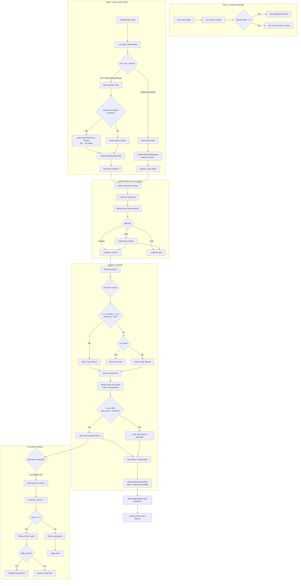

# Font Generator - Logic Flow (Pages 0-1)

*Created: 2026-01-27*

## Overview

The Font Generator wizard has 5 pages:
- **Page 0**: ImageUploadPage - Load image, select charset
- **Page 1**: SegmentationPage - Configure and run segmentation
- Page 2: CharacterMappingPage - Verify/edit character labels
- Page 3: FontSettingsPage - Font metadata
- Page 4: ExportPage - Generate font file

This document covers Pages 0-1.

---

## Page 0: ImageUploadPage

### User Actions
1. Browse/load alphabet image
2. Select character set from dropdown:
   - Index 0: Uppercase (A-Z) = 26 chars
   - Index 1: Lowercase (a-z) = 26 chars
   - Index 2: Upper + Lower = 52 chars
   - Index 3: Upper + Digits = 36 chars
   - Index 4: Full (A-Z, a-z, 0-9) = 62 chars
   - Index 5: Custom (user enters chars)

### Key Functions
- `get_expected_chars()` - Returns charset string based on dropdown selection
- `isComplete()` - Returns True only if valid image loaded

---

## Page 1: SegmentationPage

### User Settings
- **Method**: Contour-based (0), Grid-based (1), Auto (2)
- **Include small glyphs (punctuation)**: Checkbox - adds 32 punctuation chars
- **Use AI assist**: Checkbox - enables Gemini for splitting/identification
- **Invert colors**: For dark backgrounds
- **Grid rows/cols**: For grid-based method
- **Padding**: Pixels around each character

### Key Function: `initializePage()` (called when page shown)

Automatically runs segmentation via `_run_auto_segmentation()`

---

## Segmentation Flow Diagram



---

## Key Issue: Label Assignment

The critical logic at `segmentation.py:703`:

```python
char = CharacterCell(
    label=self.expected_chars[idx],  # Sequential assignment!
    bbox=(x, y, w, h),
    image=cell_img,
)
```

**Labels are assigned based on POSITION, not visual recognition.**

If sorting or merging produces wrong bbox order, ALL labels after that point are wrong.

---

## Merge Logic (`_merge_component_bboxes`)

Purpose: Combine dots with stems for i, j, etc.

Criteria for merging bbox A with bbox B:
1. **Size ratio**: One must be < 50% area OR < 50% height of other
2. **Horizontal overlap**: 30% overlap OR center within bounds
3. **Vertical gap**: < 50% of average character height
4. **Limit**: Max 2 components per merge (prevents over-merging)

---

## AI Split Logic (`_find_split_points_ai`)

When wide bbox detected (w > median * 1.8):

1. Extract region image
2. Send to Gemini with prompt asking for character count
3. Parse response: `COUNT: n` and `SPLITS: percentages`
4. If count=1: Return `[]` (empty list = don't split)
5. If count>1: Return split pixel positions
6. **Fallback**: If AI returns None (error), use projection analysis

**Bug Fixed**: Previously returned `None` for count=1, which triggered fallback.
Now returns `[]` which means "confirmed single char, no split needed."

---

## Settings That Affect Segmentation

| Setting | Effect |
|---------|--------|
| `include_small_glyphs` | Adds 32 punctuation chars to expected_chars |
| `use_ai` | Enables Gemini for split analysis |
| `invert` | Inverts black/white for dark backgrounds |
| `min_char_size` | Default 20px - minimum bbox dimension |
| `padding` | Pixels added around extracted glyphs |

---

## Common Failure Modes

1. **Wrong label assignment**: Sorting puts bboxes in wrong order
2. **Over-merging**: Adjacent chars merged (fixed: limit to 2)
3. **Incorrect splitting**: AI says 1 char but projection splits anyway (fixed)
4. **Missing flat chars**: Underscore/hyphen rejected as "elongated" (fixed)
5. **Character count mismatch**: Image has different chars than expected
