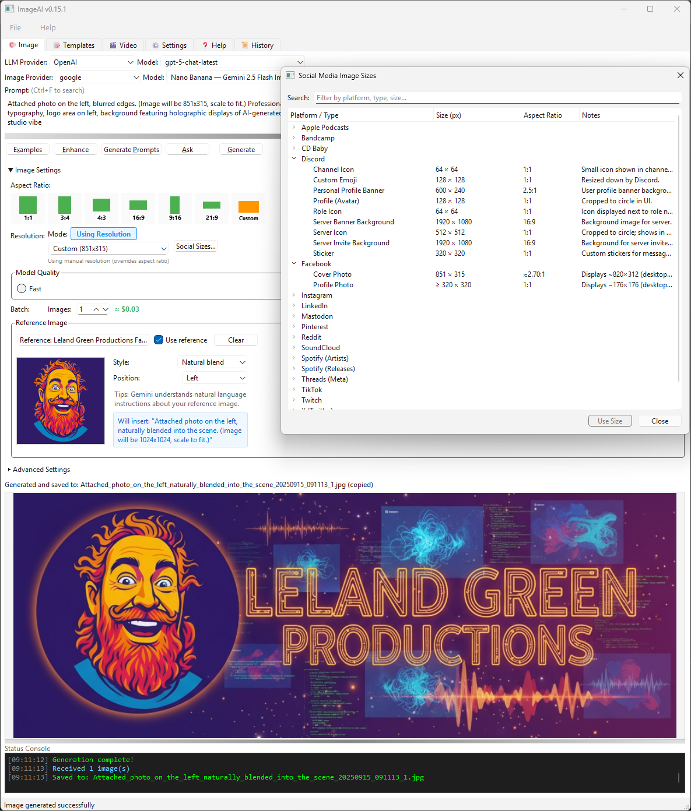
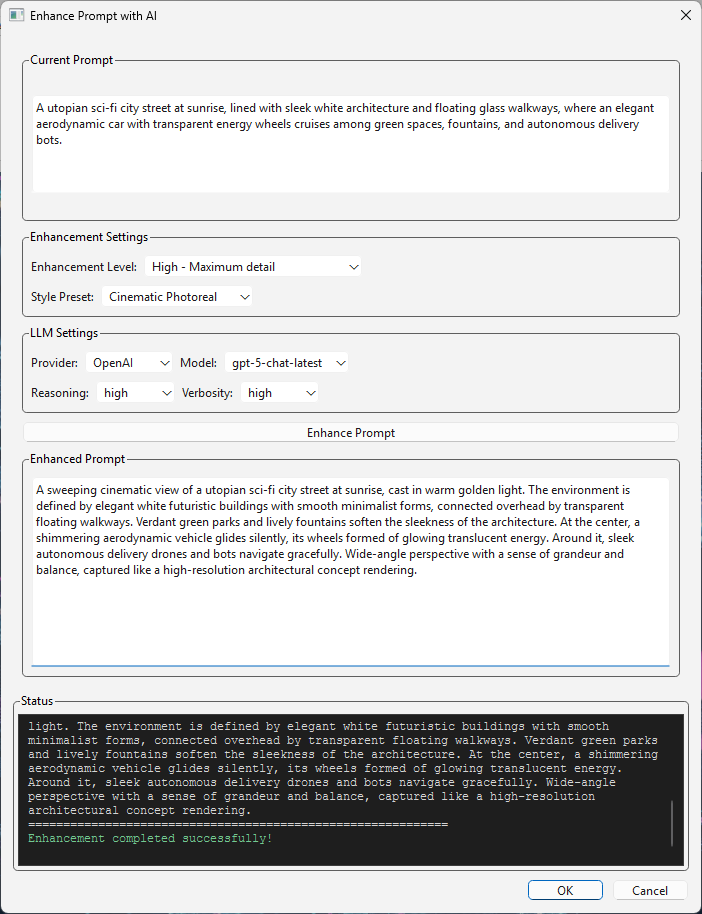
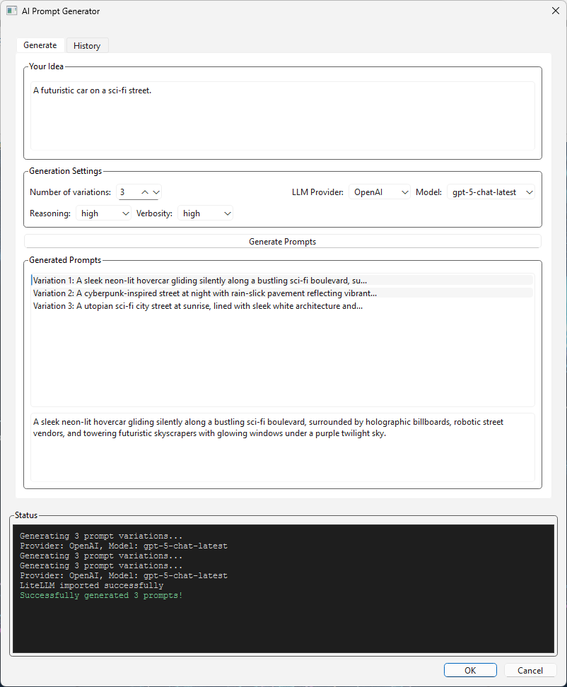

# ImageAI — Advanced AI Image Generation

### [ImageAI on GitHub](https://github.com/lelandg/ImageAI) Desktop + CLI for multi‑provider AI image and video generation with enterprise auth, prompt tools, and MIDI‑synced karaoke/video workflows.

**Version 0.23.0**

**See [LelandGreen.com](https://www.lelandgreen.com) for links to other code and free stuff**. _Under construction. Implementing social links soon._ 
- **LelandGreen.com on Discord - The Intersection of Art and AI [Discord](https://discord.gg/a64xRg9w)**
- **Facebook Page: [Leland Green Productions](https://www.facebook.com/LelandGreenProductions)**
- **Facebook Group: [The Intersection of Art and AI Community](https://www.facebook.com/groups/4047864425428695)**
 
#### Created with _JetBrains **PyCharm**_ and AI assistance from Junie, Claude Code, Codex. With Google auth guidance from Gemini CLI.
###### Enterprise-ready with multiple authentication methods and provider support  

## Overview

**ImageAI** is a powerful desktop application and CLI tool for AI image generation supporting multiple providers including Google's Gemini API, OpenAI's DALL·E models, Stability AI's Stable Diffusion, and local Stable Diffusion models. It features enterprise-grade authentication options, secure credential management, and works seamlessly across Windows, macOS, and Linux.

## Table of Contents
- [Project Review & Recommendations](Docs/ProjectReview.md)
- [Requirements](#1-requirements)
- [Authentication Setup](#2-authentication-setup)
- [Installation](#3-installation)
- [Running the Application](#4-running-the-application)
- [Authentication Management](#5-authentication-management)
- [CLI Reference](#6-cli-reference)
- [GUI Features](#7-gui-features)
- [Image Management](#8-image-management)
- [Examples and Templates](#9-examples-and-templates)
- [Advanced Features](#10-advanced-features)
- [Utility Scripts](#11-utility-scripts)
- [Frequently Asked Questions](#12-frequently-asked-questions)
- [Pricing and Cost Comparison](#13-pricing-and-cost-comparison)
- [API Reference](#14-api-reference)
- [Development](#15-development)
- [Changelog](CHANGELOG.md)
- [Screenshots Gallery](#17-screenshots-gallery)



## Key Features

### 🎨 Multi-Provider Support
- **Google Gemini** - Access to latest Gemini models for image generation
- **OpenAI DALL·E** - Support for DALL·E-3 and DALL·E-2 models
- **Stability AI** - Stable Diffusion XL, SD 2.1, and more via API
- **Local Stable Diffusion** - Run models locally without API keys (GPU recommended)
- Easy provider switching in both GUI and CLI
- Support for custom Hugging Face models
- Model browser and downloader for Local SD models
- Popular model recommendations with descriptions

### 🔐 Flexible Authentication
- **API Key Authentication** - Simple setup for individual users
- **Google Cloud Authentication** - Enterprise-ready with Application Default Credentials
- **Hugging Face Authentication** - Built-in token management for model downloads
- Secure credential storage in platform-specific directories

### 🚀 AI Image Upscaling
- **Real-ESRGAN** - State-of-the-art AI upscaling for enhanced image quality
- **GPU Acceleration** - Automatic NVIDIA GPU detection for faster processing
- **GUI Installation** - One-click installation directly from the application
- **Multiple Methods** - Choose between AI upscaling, Lanczos, or cloud services
- Smart upscaling when target resolution exceeds provider capabilities
- Environment variable support for CI/CD integration
- Per-provider API key management

### 💻 Triple Interface
- **Modern GUI** - User-friendly desktop interface built with Qt/PySide6
- **Video Project** - Full-featured 🎬 Video tab for creating AI-powered videos with version control
- **Powerful CLI** - Full-featured command-line interface for automation
- Cross-platform support (Windows, macOS, Linux)
- Responsive layout with resizable panels

### 🎯 Advanced Generation Controls

- **Reference Image Support** - Start with an existing image (provider-dependent):
    - Select reference image from file
    - Enable/disable reference with checkbox
    - Clear reference with one click
    - Thumbnail preview of selected image
    - Provider-optimized reference handling
    - Automatic prompt enhancement with reference context
- **Enhanced Aspect Ratio Selector** - Interactive preview rectangles with custom input support:
  - Visual preset buttons for common ratios (1:1, 3:4, 4:3, 16:9, 9:16, 21:9)
  - **Custom aspect ratio input** - Enter any ratio like "16:10" or decimal "1.6"
  - Clear mode indicator showing "Using Aspect Ratio" or "Using Resolution"
  - Automatic resolution calculation based on provider capabilities
- **Smart Resolution System** - Dual-mode resolution control:
  - **Auto mode** - Resolution calculated from selected aspect ratio
  - **Manual mode** - Direct resolution selection overrides aspect ratio
  - Provider-optimized presets (DALL·E, Gemini, Stability AI)
  - Visual feedback showing which mode is active (green for AR, blue for resolution)
  - **Social Media Sizes Dialog** - Quick access to platform-specific image dimensions for Instagram, Twitter/X, Facebook, LinkedIn, YouTube, TikTok, and more
- **Quality & Style Options** - Standard/HD quality, style presets for different looks
- **Batch Generation** - Generate multiple variations at once
- **Cost Estimation** - Real-time cost calculation for all providers
- **Advanced Settings Panel** - Fine-tune generation parameters:
  - Inference steps (1-50)
  - Guidance scale (CFG 0-20)
  - Scheduler selection
  - Seed control for reproducibility
  - Negative prompts
  - Prompt rewriting/enhancement

### 📊 Enhanced History and Tracking
- **Detailed History Table** - View all generations with:
  - Date and time stamps
  - Provider and model used
  - Resolution information
  - Cost tracking
  - Original prompts
- **Session Persistence** - All UI settings saved between sessions
- **Metadata Sidecars** - JSON files with complete generation details
- **Disk History Scanning** - Automatically finds previous generations
- **Quick History Access** - Click to reload prompts and settings

### 🖼️ Smart Features
- Auto-save generated images with metadata sidecars
- Template system with placeholder substitution
- Customizable output paths and filenames
- Auto-copy filename to clipboard option
- Smart filename generation from prompts

### ⌨️ Keyboard Shortcuts & Accessibility
- **Comprehensive keyboard navigation** - Full keyboard control for all features
- **Button mnemonics** - Alt+key shortcuts for all buttons (e.g., Alt+G for Generate)
- **Global shortcuts**:
  - **Ctrl+Enter** - Generate image from anywhere in the Generate tab
  - **Ctrl+S** - Save generated image
  - **Ctrl+Shift+C** - Copy image to clipboard
  - **F1** - Jump to Help tab
- **Text field support** - Ctrl+Enter works even when typing in the prompt field
- **Tooltips** - All buttons show their keyboard shortcuts
- **Screen reader compatible** - Proper labels and navigation order
- Image format detection and optimization
- Preview scaling with aspect ratio preservation

### 🤖 LLM Integration (NEW!)

- **Global LLM Provider Selection** - Unified provider and model selection across tabs:
    - Provider dropdown syncs between Image and Video tabs
    - Model list updates automatically per provider
    - Remembers selections between sessions
    - Project-specific provider settings
- **Multi-Provider Support** - OpenAI GPT-5, Claude, Gemini, Ollama, LM Studio
  - **GPT-5 Model Support** - `gpt-5-chat-latest` (auto-updating to newest version)
  - Correctly uses `max_completion_tokens` parameter for GPT-5 and GPT-4+ models
  - **GPT-5 Specific Controls** (UI ready for future API support):
    - Reasoning effort selector (low/medium/high) - prepared for when API supports it
    - Verbosity control (low/medium/high) - prepared for when API supports it
    - Auto-shows/hides based on selected model
- **Prompt Enhancement** - One-click prompt improvement using selected LLM
  - Automatic fallback when LLM returns empty response
  - Configurable temperature and max tokens for fine-tuning
  - Works across both Image and Video tabs with shared enhancement engine
- **Ask Questions About Prompts** - Interactive Q&A dialog for prompt analysis
  - Pre-defined questions for quick insights
  - Custom question support with detailed answers
  - User-adjustable temperature (0-2) and max tokens (100-4000)
  - GPT-5 reasoning and verbosity controls when using GPT-5 models
  - Session persistence - remembers last question, settings, and GPT-5 parameters
  - History tracking of all Q&A interactions
- **Automatic Model Syncing** - Provider and model selections sync between tabs
- **Smart Model Detection** - Automatically populates available models per provider

### 💻 Enhanced UI Features (NEW!)

- **Reference Image Panel** - UI controls for starting with reference images:
    - File selection dialog
    - Reference image thumbnail
    - Enable/disable checkbox
    - Clear button
    - Provider compatibility indicators
- **Status Bar** - Real-time status messages and provider connection feedback
- **Console Output Window** - Terminal-style log with color-coded messages:
  - Timestamp for each operation
  - Color coding: Green (success), Red (errors), Blue (progress), Yellow (responses)
  - Visual separators between operations
  - Resizable with splitter control
- **Improved Startup** - Progress messages during initialization
- **Lazy Video Tab Loading** - Faster startup by loading video features on-demand

### 🎬 Video Project Features
- **Complete Video Creation Pipeline** - Text to video with AI scene generation
- **Version Control System** - Event sourcing with time-travel capabilities
- **Dual Rendering Engines** - FFmpeg slideshow and Google Veo AI (coming soon)
- **Multi-Provider LLM Integration** - Enhance prompts with GPT-5, Gemini, Claude, and more
- **Visual Continuity System** - Maintain consistency across scenes with provider-specific techniques
- **Smart Lyric Processing** - Automatic detection and visual scene creation from song lyrics
- **Professional Effects** - Ken Burns, transitions, audio sync
- **Project History** - Complete audit trail with restore points

### 🎵 MIDI Synchronization & Karaoke (NEW!)
- **MIDI-Based Timing** - Perfect beat/measure alignment for scene transitions
- **Musical Structure Detection** - Identify verses, choruses, bridges from MIDI
- **Karaoke Overlays** - Bouncing ball, highlighting, fade-in styles
- **Lyric Export Formats** - Generate LRC, SRT, and ASS subtitle files
- **Word-Level Synchronization** - Extract timing from MIDI lyric events
- **Adjustable Snap Strength** - Control how tightly scenes align to beats
- **Audio Track Support** - Link MP3, WAV, M4A files without copying
- **Volume & Fade Controls** - Professional audio mixing options

### 🔧 Developer Features
- Modular architecture with provider abstraction
- Worker threads for non-blocking generation
- Comprehensive error handling and recovery
- Progress tracking and status updates
- Event-driven architecture with Qt signals
- Extensible provider system for new services

## 1. Requirements

- Python 3.9+ (3.9 to 3.13 supported)
- Internet connection
- Google account (for Gemini) or OpenAI account (for DALL·E)
- Dependencies (auto-installed via requirements.txt):
  - `google-genai` - Google Gemini API client
  - `google-cloud-aiplatform` - Google Cloud authentication support
  - `openai` - OpenAI API client
  - `PySide6` - GUI framework (optional for CLI-only usage)
  - `pillow` - Image processing
  - `protobuf` - Protocol buffer support
  - `pretty-midi` - MIDI file analysis and timing extraction
  - `mido` - Low-level MIDI manipulation for lyrics and events
  - `moviepy` - Video processing and assembly
  - `litellm` - Unified LLM provider interface (for video prompts)

## 2. Authentication Setup

### Google Gemini Authentication

You have two options for authenticating with Google's Gemini API:

#### Option A: API Key (Recommended for Individual Users)

1. **Get your API key**:
   - Visit [Google AI Studio](https://aistudio.google.com/apikey)
   - Create a new API key or use an existing one
   - Copy the key (keep it secure!)

2. **Review documentation**:
   - [Gemini API Overview](https://ai.google.dev/)
   - [Pricing and Quotas](https://ai.google.dev/pricing)
   - [Safety Policies](https://ai.google.dev/gemini-api/docs/safety)

3. **Enable billing if required**:
   - Some regions/models require billing
   - Visit [Google AI Pricing](https://ai.google.dev/pricing)

#### Option B: Google Cloud Account (Enterprise/Advanced Users)

1. **Install Google Cloud CLI**:
   - Download from [Google Cloud SDK](https://cloud.google.com/sdk/docs/install)
   - Windows: Use the interactive installer
   - macOS: `brew install google-cloud-sdk`
   - Linux: Follow distribution-specific instructions

2. **Set up Google Cloud project**:
   - Create/select project at [Cloud Console](https://console.cloud.google.com/projectcreate)
   - Note your Project ID

3. **Authenticate**:
   ```bash
   # Login to Google account
   gcloud auth application-default login
   
   # Set your project
   gcloud config set project YOUR_PROJECT_ID
   
   # Verify authentication
   gcloud auth list
   ```

4. **Enable required APIs**:
   ```bash
   gcloud services enable aiplatform.googleapis.com
   gcloud services enable cloudresourcemanager.googleapis.com
   ```
   Or enable via [Cloud Console](https://console.cloud.google.com/apis/library)

5. **Enable billing**:
   - Visit [Cloud Billing](https://console.cloud.google.com/billing)
   - New accounts may have free credits

### OpenAI Authentication

1. **Get your API key**:
   - Sign in at [OpenAI Platform](https://platform.openai.com/)
   - Create API key at [API Keys page](https://platform.openai.com/api-keys)

2. **Review documentation**:
   - [Rate Limits](https://platform.openai.com/docs/guides/rate-limits)
   - [Pricing](https://openai.com/pricing)

## 3. Installation

### Quick Setup

```bash
# Clone the repository
git clone https://github.com/yourusername/ImageAI.git
cd ImageAI

# Create virtual environment (recommended)
python -m venv .venv

# Activate virtual environment
# Windows PowerShell:
.\.venv\Scripts\Activate.ps1
# Windows Command Prompt:
.venv\Scripts\activate.bat
# macOS/Linux:
source .venv/bin/activate

# Install core dependencies
pip install -r requirements.txt

# Optional: Install Local Stable Diffusion support
# For CPU-only:
pip install -r requirements-local-sd.txt

# For GPU support (CUDA):
pip install torch torchvision --index-url https://download.pytorch.org/whl/cu121
pip install -r requirements-local-sd.txt
```

### Platform-Specific Notes

- **Windows**: Ensure Python is added to PATH during installation
- **macOS**: You may need to install Xcode Command Line Tools
- **Linux**: Install python3-venv if not present: `sudo apt install python3-venv`

## 4. Running the Application

### GUI Mode (Default)

```bash
# Launch the graphical interface
python main.py
```

### CLI Mode

```bash
# Show help
python main.py -h

# Quick examples
python main.py -p "A majestic mountain landscape at sunset" -o mountain.png
python main.py --provider openai -m dall-e-3 -p "Futuristic cityscape" -o city.png
```

### Authentication Examples

#### Using API Keys

```bash
# Google Gemini with API key
python main.py -s -k "YOUR_GOOGLE_API_KEY"  # Save key
python main.py -p "Beautiful ocean sunset" -o ocean.png  # Generate

# OpenAI with API key
python main.py --provider openai -s -k "YOUR_OPENAI_API_KEY"  # Save key
python main.py --provider openai -m dall-e-3 -p "Abstract art" -o art.png  # Generate

# Using environment variables
export GOOGLE_API_KEY="YOUR_KEY"  # Linux/macOS
$env:GOOGLE_API_KEY = "YOUR_KEY"  # Windows PowerShell
python main.py -p "Mountain landscape"  # Uses env variable
```

#### Using Google Cloud Authentication

```bash
# First-time setup
gcloud auth application-default login
gcloud config set project YOUR_PROJECT_ID

# Generate images
python main.py --auth-mode gcloud -p "Tropical paradise" -o paradise.png

# Test authentication
python main.py --auth-mode gcloud -t
```

#### Loading Keys from Files

```bash
# Save key from file
python main.py -s -K /path/to/key.txt

# Use key file directly (one-time)
python main.py -K /path/to/key.txt -p "Desert oasis" -o oasis.png
```

## 5. Authentication Management

### Key Storage Locations

Configuration and keys are stored in platform-specific directories:

- **Windows**: `%APPDATA%\ImageAI\config.json`
- **macOS**: `~/Library/Application Support/ImageAI/config.json`
- **Linux**: `~/.config/ImageAI/config.json`

### Authentication Precedence

For each provider, the authentication order is:
1. Command-line key (`-k` or `-K` flags)
2. Stored configuration
3. Environment variables (`GOOGLE_API_KEY`, `OPENAI_API_KEY`)
4. Google Cloud ADC (for Google provider with `--auth-mode gcloud`)

### Security Best Practices

- Never commit API keys to version control
- Use environment variables for CI/CD
- Rotate keys regularly
- Use Google Cloud authentication for enterprise deployments
- Store keys in secure password managers

## 6. CLI Reference

### Core Arguments

```
-h, --help              Show help message
-p, --prompt TEXT       Prompt for image generation
-o, --out PATH          Output path for generated image
-m, --model TEXT        Model to use (provider-specific)
-t, --test              Test authentication
```

### Authentication Arguments

```
-k, --api-key TEXT      API key string
-K, --api-key-file PATH Path to file containing API key
-s, --set-key           Save the provided key
--auth-mode {api-key|gcloud}  Google auth mode (default: api-key)
```

### Provider Arguments

```
--provider {google|openai|stability|local_sd}  Provider to use (default: google)
```

### Model Defaults

- **Google**: `gemini-2.5-flash-image-preview`
- **OpenAI**: `dall-e-3`
- **Stability AI**: `stable-diffusion-xl-1024-v1-0`
- **Local SD**: `stabilityai/stable-diffusion-2-1`

### Complete Examples

```bash
# Test authentication
python main.py -t
python main.py --provider openai -t
python main.py --provider stability -t
python main.py --provider local_sd -t  # Check if ML deps installed
python main.py --auth-mode gcloud -t

# Generate with different providers
python main.py -p "Sunset over mountains" -o sunset.png
python main.py --provider openai -m dall-e-2 -p "Abstract art" -o abstract.png
python main.py --provider stability -p "Fantasy landscape" -o fantasy.png
python main.py --provider local_sd -p "Cyberpunk city" -o cyber.png
python main.py --auth-mode gcloud -p "Space station" -o space.png

# Save and use API keys
python main.py -s -k "YOUR_KEY"  # Save to config
python main.py --provider stability -s -k "YOUR_STABILITY_KEY"
python main.py -K ~/keys/api.txt -p "Ocean waves"  # Use from file
```

### Video Generation with MIDI Sync (NEW!)

```bash
# Basic video generation with slideshow
python main.py video --in lyrics.txt --provider gemini --slideshow \
  --audio /path/to/music.mp3 --out video.mp4

# MIDI-synchronized video with beat alignment
python main.py video --in lyrics.txt --midi /path/to/song.mid \
  --audio /path/to/song.mp3 --sync-mode measure --snap-strength 0.9 \
  --out synced_video.mp4

# Video with karaoke overlay
python main.py video --in lyrics.txt --midi song.mid --audio song.mp3 \
  --karaoke --karaoke-style bouncing_ball \
  --export-lrc --export-srt --export-ass \
  --out karaoke_video.mp4

# Using Veo AI for video generation (when available)
python main.py video --in script.txt --veo-model veo-3.0-generate-001 \
  --audio soundtrack.mp3 --out ai_video.mp4
```

## 7. GUI Features

### Main Interface

#### Image Tab (Primary)
- **Model Selection**: Dropdown with provider-specific models
- **Prompt Input**: Multi-line text area with built-in search (Ctrl+F)
- **AI Prompt Tools**:
  - **Enhance Prompt**: Improve your prompt with AI assistance
  - **Generate Prompts**: Create multiple prompt variations with history tracking
  - **Ask AI Anything**: Interactive AI assistant for prompt help or general questions
    - Works with or without a prompt
    - Continuous conversation mode with context retention
    - Editable prompt field with clear edit controls
    - Conversation history saved across sessions
  - **Reference Image Analysis**: Analyze images to generate detailed descriptions
    - Upload any image for AI analysis
    - Customizable analysis prompts
    - Copy descriptions directly to main prompt
- **Generate Button**: Start image generation with progress tracking
- **Image Display**: High-quality preview with automatic scaling
- **Generation Controls**:
  - Aspect ratio selector with visual previews
  - Resolution selector with provider-optimized presets
  - Quality settings (Standard/HD)
  - Batch size selector (1-4 images)
  - Cost estimator showing real-time pricing
- **Reference Image** (Google Gemini only):
  - Select a starting image to guide generation
  - Visual preview thumbnail with controls
  - Style options: Natural blend, Blurred edges, In circle, In frame, As background, etc.
  - Position options: Auto, Left, Center, Right, Top, Bottom, corners
  - Auto-inserts natural language instructions into prompt
  - Shows preview of what will be inserted
  - Tip: Press Ctrl+F to search text in prompt field
  - Includes resolution info automatically
  - Enable/disable checkbox
  - Clear button to remove reference
- **Advanced Settings** (collapsible panel):
  - Inference steps slider (1-50)
  - Guidance scale (CFG) control
  - Scheduler selection
  - Seed input for reproducibility
  - Negative prompt field
  - Prompt rewriting toggle
- **Output Text**: Live generation status and file paths
- **Examples Button**: Access curated prompts library

#### Templates Tab
- **Predefined Templates**: Ready-to-use prompts with customizable placeholders
- **Quick Generation**: Jump-start your creativity with proven prompt patterns
- **Placeholder System**: Customize templates with your own variables

#### Video Tab
The Video Project feature provides comprehensive tools for creating AI-powered videos from text, with advanced version control and multiple rendering options.

**Project Management**:
- **Workspace and History Tabs**: Dual-tab interface for active editing and version control
- **Project Operations**: Create, open, save, and manage multiple video projects
- **Auto-save**: Automatic project saving after generation operations
- **Project Directory**: Organized storage in `~/.imageai/video_projects/`

**Text Processing**:
- **Multiple Input Formats**:
  - Timestamped lyrics: `[00:30] First verse lyrics`
  - Structured sections: `# Verse 1`, `# Chorus`, `# Bridge`
  - Plain text with intelligent scene detection
  - Custom scene markers for precise control
- **Smart Scene Detection**: Automatic breaking of text into scenes based on:
  - Timestamps in lyrics
  - Section headers
  - Paragraph breaks
  - Semantic analysis

**Storyboard & Scene Management**:
- **Interactive Scene Table**: Edit titles, durations, and prompts directly
- **Timing Controls**: Adjustable duration for each scene (0.5-30 seconds)
- **Scene Reordering**: Drag-and-drop to rearrange scenes
- **Batch Operations**: Apply settings to multiple scenes at once
- **Preview**: Real-time preview of scene timings and transitions

**AI-Powered Enhancement**:
- **Multi-Provider LLM Support**:
  - OpenAI GPT-5 and GPT-4o
  - Anthropic Claude 3.5 Sonnet, Opus, Haiku
  - Google Gemini 2.0 Flash and Pro models
  - Local Ollama models
- **Prompt Styles**:
  - Cinematic: Movie-like dramatic scenes
  - Artistic: Painterly and stylized visuals
  - Photorealistic: High-fidelity realistic images
  - Animated: Cartoon and animation styles
  - Documentary: Authentic, journalistic look
  - Abstract: Experimental and artistic
- **Batch Enhancement**: Process all scenes with consistent style

**Image Generation**:
- **Multi-Provider Support**: Generate with Google Gemini, OpenAI DALL-E, Stability AI
- **Variant Generation**: Create 1-4 variations per scene
- **Concurrent Processing**: Generate multiple scenes in parallel
- **Smart Caching**: Hash-based caching to avoid regenerating identical prompts
- **Thumbnail System**: Automatic thumbnail generation with composite previews
- **Cost Tracking**: Real-time cost estimation and tracking per scene

**Video Rendering Options**:

1. **FFmpeg Slideshow Rendering**:
   - **Ken Burns Effects**: Automatic pan and zoom animations
   - **Transitions**: Smooth crossfade between scenes
   - **Multiple Aspect Ratios**: 16:9, 4:3, 9:16 (vertical), 1:1 (square)
   - **Resolution Options**: Up to 4K output
   - **Frame Rate Control**: 24, 30, or 60 fps
   - **Audio Integration**: Sync with audio tracks

2. **Google Veo AI Video** (Planned):
   - **True AI Video**: Generate motion video from text
   - **Model Selection**: Veo Pro, Veo Dev, Veo Flash
   - **Duration Control**: 5-10 second clips per scene
   - **Advanced Features**: Camera movements, visual styles

**Version Control and History**:
- **Event Sourcing Architecture**: Complete history of all changes
- **Time Travel**: Restore project to any point in history
- **History Timeline**: Visual timeline with event markers
- **Event Types Tracked**:
  - Project creation and saves
  - Scene additions and edits
  - Prompt enhancements
  - Image generations
  - Video renders
- **Filtering and Search**: Find specific events quickly
- **Restore Points**: One-click restoration to previous states
- **Diff Viewer**: See exact changes between versions

**Audio & MIDI Support**:
- **Audio Track Integration**: Link MP3/WAV/M4A/OGG files without copying
- **MIDI Synchronization**: Load MIDI files for precise timing control
  - Beat grid alignment for scene transitions
  - Measure and section synchronization
  - Tempo and time signature display
  - Musical structure detection (verse, chorus, bridge)
- **Karaoke Features**:
  - Bouncing ball, highlighting, and fade-in styles
  - Export to LRC, SRT, and ASS formats
  - Word-level timing from MIDI lyrics
  - Customizable font size and position
- **Audio Controls**:
  - Volume adjustment with real-time preview
  - Fade in/out transitions
  - Trim controls for start/end offsets
- **Sync Options**: 
  - None, Beat, Measure, or Section alignment
  - Adjustable snap strength (0-100%)
  - Extract lyrics from MIDI files

**Advanced Settings**:
- **Generation Settings**:
  - Image provider and model selection
  - Quality settings per provider
  - Batch size and concurrency limits
- **Render Settings**:
  - Output format (MP4, AVI, MOV)
  - Codec selection
  - Bitrate control
  - Metadata embedding
- **Performance Options**:
  - GPU acceleration toggle
  - Memory usage limits
  - Cache management

#### Settings Tab
- **Provider Selection**: Switch between Google, OpenAI, Stability AI, and Local SD
- **Authentication Mode** (Google only):
  - API Key mode with key input field
  - Google Cloud Account mode with status display
- **Helper Buttons**:
  - Get API Key - Opens provider's key page
  - Load from File - Import key from text file
  - Check Status - Verify authentication
  - Cloud Console - Open Google Cloud Console (Google only)
- **Auto-save Options**: 
  - Auto-save generated images toggle
  - Copy filename to clipboard option
  - Custom output directory selection
- **Local SD Settings** (when selected):
  - Model browser and downloader
  - Hugging Face authentication
  - Cache directory management
  - GPU/CPU device selection

#### Templates Tab
- Predefined prompt templates with placeholders
- Variable substitution system with live preview
- Template categories:
  - Art Style
  - Photography
  - Design
  - Character
  - Scene
  - Product
  - Marketing
- Append or replace current prompt
- Custom template creation and saving

#### History Tab
- **Detailed History Table** with columns:
  - Date and time
  - Provider used
  - Model name
  - Resolution
  - Cost (when applicable)
  - Original prompt
- **Quick Actions**:
  - Click to reload prompt and settings
  - Open image file location
  - View metadata sidecar
- **Search and Filter**:
  - Filter by provider
  - Search by prompt text
  - Sort by date, cost, or model

#### Help Tab
- Embedded README documentation with full content
- **Interactive Search**:
  - Search box with real-time results
  - Navigate between matches with Previous/Next buttons
  - Match counter showing current/total results
  - Keyboard shortcuts (F3 for next, Shift+F3 for previous)
- Navigation controls:
  - Back/Forward buttons for history
  - Home button to return to top
  - Keyboard navigation (Alt+Left/Right, Backspace)
- Quick reference guide
- Keyboard shortcuts reference
- Provider-specific tips
- Troubleshooting guide

### Menu System

#### File Menu
- New Generation (Ctrl+N)
- Save Image As... (Ctrl+S)
- Open Output Directory
- Recent Files
- Exit (Ctrl+Q)

#### Edit Menu
- Copy Prompt (Ctrl+C)
- Paste Prompt (Ctrl+V)
- Clear All (Ctrl+Shift+C)
- Copy Image to Clipboard
- Copy Filename

#### View Menu
- Show/Hide History Panel
- Show/Hide Advanced Settings
- Full Screen Mode (F11)
- Reset Layout
- Zoom In/Out

#### Tools Menu
- Model Browser (Local SD)
- Batch Generator
- Template Editor
- Settings Manager

#### Help Menu
- Documentation (F1)
- Keyboard Shortcuts
- Check for Updates
- About ImageAI

## 8. Image Management

### Auto-Save System

Generated images are automatically saved to:
- **Windows**: `%APPDATA%\ImageAI\generated\`
- **macOS**: `~/Library/Application Support/ImageAI/generated/`
- **Linux**: `~/.config/ImageAI/generated/`

### File Naming

- Filenames derived from prompt (sanitized)
- Timestamp added for uniqueness
- Format: `prompt_words_YYYYMMDD_HHMMSS.png`

### Metadata Sidecars

Each image gets a `.json` sidecar file containing:
```json
{
  "prompt": "User's prompt text",
  "model": "Model used",
  "provider": "Provider name",
  "created_at": "ISO timestamp",
  "app_version": "Version number",
  "output_text": "Any text output",
  "template": "Template data if used"
}
```

### History Tracking

- In-session history of generated images
- Persistent history across sessions
- Quick access to recent generations
- Metadata search and filtering

## 9. Examples and Templates

### Example Prompts

#### Artistic Styles
```
"Oil painting of a serene mountain lake at golden hour, impressionist style"
"Cyberpunk street scene with neon lights and rain reflections, ultra-detailed"
"Watercolor portrait of a wise owl in autumn forest, soft pastels"
```

#### Photorealistic
```
"Professional photograph of a modern minimalist living room, magazine quality"
"Macro shot of dewdrops on a spider web at sunrise, shallow depth of field"
"Aerial view of tropical islands with crystal clear water, drone photography"
```

#### Creative Concepts
```
"Steampunk airship floating above Victorian London, brass and copper details"
"Bioluminescent underwater cave with glowing creatures, fantasy art"
"Isometric cutaway of a cozy treehouse library with magical elements"
```

### Template System

The template system allows you to create consistent, reusable prompts with variable placeholders.

#### Using Templates

1. **Select a Template**: Choose from the dropdown in the Templates tab
2. **Fill Placeholders**: Enter values for each variable field (optional)
3. **Preview**: See the assembled prompt update in real-time
4. **Insert**: Click "Insert into Prompt" to use the template
5. **Append Option**: Check "Append to existing" to add to current prompt

#### Built-in Templates

**Portrait Photography**:
```
"[style] portrait of [subject] with [expression], [lighting] lighting, [background] background"
```

**Landscape Scene**:
```
"[time_of_day] landscape of [location] with [features], [weather] weather, [style] style"
```

**Product Shot**:
```
"Product photography of [item] on [surface], [lighting] lighting, [angle] angle, commercial quality"
```

**Fantasy Art**:
```
"[character] [action] in [setting], [magic_effect], [art_style] fantasy art style"
```

**Architectural**:
```
"[building_type] in [architectural_style] style, [time_of_day], [weather], [perspective] view"
```

#### Template Variables

- Variables are defined with square brackets: `[variable_name]`
- Leaving a field empty removes it from the final prompt
- Multiple instances of the same variable use the same value
- Commas are automatically managed when variables are empty

### Tips for Better Results

**Be Specific**: Instead of "a cat", try "a fluffy orange tabby cat sitting on a windowsill"

**Include Style**: Add artistic style like "oil painting", "photorealistic", "cartoon style"

**Describe Mood**: Include lighting and atmosphere like "golden hour", "dramatic lighting", "cozy"

**Add Details**: More details generally produce better results

**Composition Tips**:
- Use camera angles: "aerial view", "close-up", "wide angle"
- Specify perspective: "first-person view", "isometric", "side profile"
- Include depth: "shallow depth of field", "bokeh background", "infinite focus"

**Quality Modifiers**:
- "highly detailed", "ultra-realistic", "4K", "HD"
- "professional photography", "award-winning"
- "trending on artstation", "masterpiece"

## 10. Advanced Features

### Keyboard Shortcuts

**GUI Mode**:
- **Ctrl+Enter**: Generate image
- **Ctrl+F**: Find/search in prompt text
- **F3**: Find next match
- **Shift+F3**: Find previous match
- **Escape**: Close find dialog
- **Ctrl+S**: Save current image as...
- **Ctrl+Q**: Quit application
- **Ctrl+N**: Clear prompt
- **Ctrl+A**: Select all text
- **Ctrl+C/V/X**: Copy/Paste/Cut
- **Tab**: Switch between tabs
- **F1**: Show help
- **F3**: Find next in help documentation
- **Shift+F3**: Find previous in help documentation
- **Ctrl+F**: Focus search box in help tab
- **Alt+Left/Backspace**: Navigate back in help
- **Alt+Right**: Navigate forward in help
- **Ctrl+Home**: Go to top of help

### Batch Generation

Generate multiple images with variations:

```bash
# Generate 3 variations of the same prompt
for i in {1..3}; do python main.py -p "Sunset landscape" -o "sunset_$i.png"; done

# Generate from a list of prompts
while read prompt; do
  python main.py -p "$prompt" -o "${prompt// /_}.png"
done < prompts.txt
```

### Using Environment Variables

```bash
# Set default provider
export IMAGEAI_PROVIDER="openai"
export OPENAI_API_KEY="your-key"

# Set default model
export IMAGEAI_MODEL="dall-e-3"

# Set output directory
export IMAGEAI_OUTPUT_DIR="/path/to/images"
```

### Custom Configuration

Edit config file directly:
- **Windows**: `%APPDATA%\ImageAI\config.json`
- **macOS**: `~/Library/Application Support/ImageAI/config.json`
- **Linux**: `~/.config/ImageAI/config.json`

Example config:
```json
{
  "provider": "google",
  "google_api_key": "your-key",
  "openai_api_key": "your-key",
  "stability_api_key": "your-key",
  "auto_save": true,
  "output_format": "png",
  "jpeg_quality": 95,
  "default_model": {
    "google": "gemini-2.5-flash-image-preview",
    "openai": "dall-e-3",
    "stability": "stable-diffusion-xl-1024-v1-0"
  }
}
```

### Local Stable Diffusion Settings

When using Local SD provider, advanced settings are available:

**Inference Steps**: Number of denoising steps (1-50)
- More steps = better quality but slower
- Turbo models: 1-4 steps
- Standard models: 20-50 steps
- Real-time preview of step count impact

**Guidance Scale (CFG)**: How closely to follow prompt (0-20)
- Lower (1-5): More creative/artistic
- Medium (7-8): Balanced
- Higher (10-15): More literal prompt following
- Visual indicator shows optimal range per model

**Resolution**: Output image dimensions
- SD 1.5/2.1: 512x512 optimal
- SDXL: 1024x1024 optimal
- Custom sizes supported but may affect quality
- Aspect ratio preservation with smart presets

**Scheduler**: Sampling algorithm
- DPM++ 2M Karras: Good balance
- Euler A: Fast, good for most cases
- DPM++ SDE Karras: Higher quality, slower
- DDIM: Deterministic, good for reproducibility
- LMS: Classic scheduler
- PNDM: Fast convergence

**Additional Controls**:
- **Seed**: Set specific seed for reproducible results
- **Negative Prompt**: Specify what to avoid in generation
- **VAE Selection**: Choose different VAE models for style
- **Attention Slicing**: Memory optimization for large images
- **CPU Offload**: Move models to CPU when not in use

### Hugging Face Model Management

**Using Custom Models**:
```bash
# Download a specific model
python main.py --provider local_sd -m "runwayml/stable-diffusion-v1-5" -p "Test" -o test.png

# Use downloaded model (cached)
python main.py --provider local_sd -m "runwayml/stable-diffusion-v1-5" -p "Art" -o art.png
```

**Popular Models**:
- `stabilityai/stable-diffusion-2-1`: Balanced quality/speed
- `runwayml/stable-diffusion-v1-5`: Classic, widely compatible
- `stabilityai/stable-diffusion-xl-base-1.0`: High quality, 1024x1024
- `segmind/SSD-1B`: Fast SDXL variant
- `stabilityai/sdxl-turbo`: Ultra-fast 1-4 step generation

**Model Cache Location**:
- Default: `~/.cache/huggingface/hub/`
- Size: Models range from 2GB to 7GB
- First use downloads the model
- Subsequent uses load from cache

### Performance Optimization

**GPU Acceleration** (Local SD only):
```bash
# Install CUDA support
pip install torch torchvision --index-url https://download.pytorch.org/whl/cu121

# Verify GPU is detected
python -c "import torch; print(torch.cuda.is_available())"
```

**Memory Management**:
- Close other applications when using Local SD
- Use smaller models for limited VRAM (< 6GB)
- Enable attention slicing for large images
- Reduce batch size if out of memory

### Troubleshooting Common Issues

#### Startup Performance

The application may take a few seconds to start as it loads AI provider libraries:
- **Google Cloud AI**: ~10-15 seconds on first load (largest library)
- **Google Gemini**: ~2 seconds
- **OpenAI**: ~3 seconds

You'll see "Loading provider: [name]..." in the console during startup. Provider libraries are cached after first load, so switching between providers is faster after the initial import.

#### Authentication Errors

**Google API Key Issues**:
- Verify key at [AI Studio](https://aistudio.google.com/apikey)
- Check billing is enabled
- Ensure API is not restricted by IP

**Google Cloud Auth Issues**:
```bash
# Verify authentication
gcloud auth list
gcloud auth application-default print-access-token

# Enable required APIs
gcloud services enable aiplatform.googleapis.com
gcloud services enable cloudresourcemanager.googleapis.com

# Check project
gcloud config get-value project
```

**OpenAI Issues**:
- Verify key at [OpenAI Platform](https://platform.openai.com/api-keys)
- Check rate limits and quotas
- Ensure billing is active

#### Installation Problems

**Windows PowerShell**:
```powershell
# If scripts are blocked
Set-ExecutionPolicy -ExecutionPolicy RemoteSigned -Scope CurrentUser

# If gcloud not found
$env:PATH += ";C:\Program Files (x86)\Google\Cloud SDK\google-cloud-sdk\bin"
```

**Module Import Errors**:
```bash
# Reinstall specific package
pip install --upgrade google-genai
pip install --upgrade PySide6

# Clear pip cache
pip cache purge
```

#### GUI Issues

**PySide6 not loading**:
```bash
# Install with specific version
pip install PySide6==6.5.3

# Linux: Install system dependencies
sudo apt-get install python3-pyside6
```

**Display scaling issues**:
```bash
# Set Qt scaling
export QT_AUTO_SCREEN_SCALE_FACTOR=1
export QT_SCALE_FACTOR=1.25
```

### Error Messages

| Error | Solution |
|-------|----------|
| "API key not found" | Set key via Settings or use `-s -k YOUR_KEY` |
| "Quota exceeded" | Check billing and quotas in provider console |
| "Invalid prompt" | Avoid restricted content, check provider policies |
| "Module not found" | Run `pip install -r requirements.txt` |
| "gcloud not found" | Install Google Cloud SDK or use API key mode |

## 11. Utility Scripts

### Configuration Migration (`migrate_config.py`)

Migrates old configuration formats to the current structure and optionally secures API keys.

**Usage:**
```bash
# Dry run to see what changes would be made
python migrate_config.py --dry-run

# Perform migration
python migrate_config.py

# Migration without securing keys
python migrate_config.py --no-secure
```

**What it does:**
- Removes legacy `api_key` field from root level
- Fixes incorrect `keys.<provider>` structure
- Moves all API keys to proper `providers.<provider>.api_key` format
- Attempts to secure keys in system keyring when available
- Creates timestamped backups before making changes

### API Key Security (`secure_keys.py`)

**Windows only:** Moves API keys from plaintext config.json to Windows Credential Manager for encryption.

**Usage (run in Windows PowerShell/Command Prompt, not WSL):**
```bash
cd D:\path\to\ImageAI
python secure_keys.py
```

**What it does:**
- Reads API keys from config.json
- Stores them securely in Windows Credential Manager (encrypted by OS)
- Removes plaintext keys from config.json
- Creates backup before modification
- Keys are automatically retrieved by the app when needed

**Benefits:**
- API keys are encrypted by Windows
- Keys survive config.json deletion/corruption
- More secure than plaintext storage
- Works seamlessly with the application

## 12. Frequently Asked Questions

### General Questions

**Q: Which provider should I use?**
A: It depends on your needs:
- **Google Gemini**: Best for general purpose, good quality, reliable
- **OpenAI DALL-E**: Best for creative/artistic images
- **Stability AI**: Best for photorealistic and detailed images
- **Local SD**: Best for privacy, unlimited generation, customization

**Q: Can I use multiple providers?**
A: Yes! You can switch providers anytime in Settings or via CLI `--provider` flag.

**Q: Are my prompts and images private?**
A: 
- API providers (Google, OpenAI, Stability) process prompts on their servers
- Local SD runs entirely on your machine - fully private
- Generated images are saved locally only

**Q: How much does it cost?**
A: See the detailed pricing table below for current rates across all providers.

### Setup Issues

**Q: "API key not found" error**
A: 
1. Make sure you've entered the key in Settings
2. Click "Save & Test" to save it
3. Check the key is valid on provider's website

**Q: "Module not found" error**
A: Run `pip install -r requirements.txt` in your terminal

**Q: GUI won't start on Linux**
A: Install system Qt libraries: `sudo apt-get install python3-pyside6`

**Q: Local SD says "No module named 'diffusers'"**
A: Install Local SD dependencies: `pip install -r requirements-local-sd.txt`

### Image Generation Issues

**Q: "Safety filter triggered" or "Blocked" message**
A: Your prompt may contain restricted content. Try:
- Rephrasing your prompt
- Avoiding violence, explicit content, or real people's names
- Using more general terms

**Q: Images are low quality**
A: 
- Add quality modifiers: "high quality", "detailed", "4K"
- Try different models (DALL-E 3, SDXL)
- For Local SD: increase steps and guidance scale

**Q: Generation is very slow**
A: 
- API providers: Network speed dependent, typically 5-20 seconds
- Local SD on CPU: Can take 2-10 minutes
- Local SD on GPU: Usually 10-60 seconds
- Use turbo models for faster generation

**Q: "Out of memory" with Local SD**
A:
- Use smaller models (SD 1.5 instead of SDXL)
- Reduce image resolution
- Close other applications
- Consider upgrading GPU VRAM

### Feature Questions

**Q: Can I edit existing images?**
A: Not yet in current version. Planned features include inpainting and image-to-image.

**Q: Can I generate multiple images at once?**
A: Currently one at a time in GUI. Use CLI with shell scripts for batch generation.

**Q: Can I use my own Stable Diffusion models?**
A: Yes! With Local SD, enter any Hugging Face model ID or use the Model Browser.

**Q: Is there a web version?**
A: Not currently. This is a desktop application. Web interface is planned for future.

**Q: Can I use this commercially?**
A: Check each provider's terms:
- Google, OpenAI: Commercial use allowed with paid plans
- Stability AI: Commercial use allowed
- Local SD: Depends on specific model license

## 13. Pricing and Cost Comparison

### Image Generation Pricing Table (January 2025)

| Provider | Model | Free Tier | API Cost per Image | Subscription Plans |
|----------|-------|-----------|-------------------|-------------------|
| **Google Gemini** | | | | |
| | Gemini 2.5 Flash (Image Preview) | **25 images/day**<br>5 requests/min<br>Via AI Studio (free) | $0.039 @ 1024x1024<br>($30 per 1M tokens) | Gemini Advanced: $19.99/mo<br>• 100-150 images/day<br>• Priority access |
| **OpenAI** | | | | |
| | DALL·E 3 | **2 images/day**<br>(via ChatGPT free) | Standard: $0.04 @ 1024x1024<br>HD: $0.08 @ 1024x1024<br>Large: $0.08-0.12 @ 1024x1792 | ChatGPT Plus: $20/mo<br>• Unlimited within caps<br>• GPT-4 access included |
| | DALL·E 2 | None | $0.02 @ 1024x1024<br>$0.018 @ 512x512<br>$0.016 @ 256x256 | Included in Plus |
| | GPT-4o Image | **40 images/month**<br>(via API free tier) | $0.035 @ 1024x1024 | Same as above |
| **Stability AI** | | | | |
| | Stable Diffusion XL | **25 free credits**<br>on signup | ~$0.01-0.02 per image<br>(credit-based) | Stable Assistant: $9/mo<br>Commercial: $20/mo<br>Enterprise: Custom |
| | SD 3.5 Large | Limited free credits | ~$0.068 @ 1024x1024<br>(via third-party APIs) | Included in plans |
| **Local SD** | | | | |
| | Any Hugging Face Model | **Unlimited** | **$0** (your hardware) | N/A |

### Detailed Pricing Notes

#### Google Gemini
- **Free Tier**: 25 requests/day, 5 RPM via AI Studio (completely free)
- **Token Pricing**: Images consume ~1,290 tokens for 1024x1024
- **Rate Limits**: Preview models have stricter limits
- **Limitations**: Currently only generates square (1:1) images regardless of aspect ratio settings
- **Best For**: Free testing, development, and moderate usage

#### OpenAI
- **Free Access**: ChatGPT free users get 2 DALL·E images/day
- **API Free Tier**: New accounts get 40 images/month free
- **Quality Tiers**: Standard vs HD (2x price for better quality)
- **Resolution Impact**: Larger sizes cost 2-3x more
- **Best For**: High-quality artistic images, professional use

#### Stability AI
- **Credit System**: 6.5 credits per image, 0.1 credit per message
- **Community License**: FREE for businesses <$1M annual revenue
- **Enterprise License**: Required for >$1M revenue (custom pricing)
- **Open Source**: Models can be self-hosted for free
- **Best For**: High-volume generation, customization needs

#### Local Stable Diffusion
- **Completely Free**: No API costs, unlimited generation
- **Hardware Requirements**: 
  - Minimum: 8GB RAM (CPU mode, slow)
  - Recommended: 6GB+ VRAM GPU
  - Optimal: 12GB+ VRAM for SDXL models
- **Generation Speed**: 
  - CPU: 2-10 minutes per image
  - GPU: 10-60 seconds per image
- **Best For**: Privacy, unlimited generation, experimentation

### Cost Optimization Tips

1. **For Hobbyists**: Use Google Gemini free tier (25 images/day)
2. **For Developers**: Start with free tiers, upgrade as needed
3. **For Production**: Compare subscription vs API costs based on volume
4. **For Privacy**: Use Local SD with one-time hardware investment
5. **For Quality**: OpenAI DALL·E 3 HD or Stability AI enterprise

### Monthly Cost Examples

| Usage Pattern | Best Option | Monthly Cost |
|--------------|-------------|--------------|
| <25 images/day | Google Gemini Free | **$0** |
| 50-100 images/day | ChatGPT Plus | $20 |
| 500 images/month | Mix free tiers + API | ~$10-20 |
| 1000+ images/month | Stability AI subscription | $20 |
| Unlimited | Local SD | $0 (after setup) |

### Enterprise and Volume Pricing

- **Google Cloud**: Custom Vertex AI pricing, volume discounts
- **OpenAI**: Enterprise agreements available, contact sales
- **Stability AI**: Custom pricing for >$1M revenue companies
- **Azure OpenAI**: Enterprise SLAs, regional deployment options

### Google Veo Video Generation Pricing

Since ImageAI's Video Project feature is designed to work with Google Veo for AI video generation, here's the current pricing:

#### AI Video Generation Models (January 2025)

| Model | Model ID | Duration | Audio | Gemini API Price | Features |
|-------|----------|----------|-------|-----------------|----------|
| **Veo 3** | `veo-3.0-generate-001` | 8 sec | ✅ Yes | $0.75/second<br>($6.00/video) | Best quality, physics-accurate |
| **Veo 3 Fast** | `veo-3.0-fast-generate-001` | 8 sec | ✅ Yes | $0.40/second<br>($3.20/video) | Optimized for speed |
| **Veo 2** | `veo-2.0-generate-001` | 5-8 sec | ❌ No | $0.35/second<br>($2.10-2.80/video) | 4K support, no audio |

#### Subscription Options

| Plan | Price/Month | Video Credits | Best For |
|------|------------|---------------|----------|
| **Google AI Pro** | $19.99 | 90 Veo 3 Fast videos | Individual creators |
| **Google AI Ultra** | $249.99 | Higher limits + Veo 3 | Professional use |
| **API Pay-as-you-go** | Usage-based | Unlimited | Developers |

**Notes**: 
- Videos are 8 seconds max (chain for longer content)
- Generated videos stored for 2 days only
- All videos include SynthID watermark
- Available in US (consumer plans), global via Vertex AI

## 14. API Reference

### Provider Specifications

#### Google Gemini Models
- `gemini-2.5-flash-image-preview` (default)
- `gemini-2.0-flash-lite-preview-02-05`
- `gemini-2.0-flash-thinking-exp-01-21`

#### OpenAI Models
- `dall-e-3` (default) - Best quality, 1024x1024
- `dall-e-2` - Good quality, multiple sizes

#### Stability AI Models
- `stable-diffusion-xl-1024-v1-0` (default) - SDXL, best quality
- `stable-diffusion-v1-6` - SD 1.6, balanced
- `stable-diffusion-512-v2-1` - SD 2.1, faster
- `stable-diffusion-xl-beta-v2-2-2` - SDXL beta

#### Local SD Models (Hugging Face)
- `stabilityai/stable-diffusion-2-1` (default)
- `runwayml/stable-diffusion-v1-5` - Popular SD 1.5
- `stabilityai/stable-diffusion-xl-base-1.0` - SDXL base
- `segmind/SSD-1B` - Fast SDXL variant
- Custom models from Hugging Face Hub

### Rate Limits

| Provider | Requests/Min | Daily Limit | Notes |
|----------|-------------|-------------|--------|
| Google (Free) | 60 | 1,500 | Varies by region |
| Google (Paid) | 360 | Unlimited | Billing required |
| OpenAI | Varies | By tier | Check dashboard |
| Stability AI | 150 | By credits | Pay per generation |
| Local SD | Unlimited | Unlimited | Limited by hardware |

### Response Formats

All API providers return images as base64-encoded PNG data or URLs, automatically decoded and saved by the application. Local SD generates images directly as PIL Image objects.

## 15. Development

### Project Structure

```
ImageAI/
├── main.py                   # Main entry point
├── cli/                      # CLI interface
├── gui/                      # GUI interface
├── core/                     # Core functionality
├── providers/                # Provider implementations
│   ├── base.py              # Base provider interface
│   ├── google.py            # Google Gemini provider
│   ├── openai.py            # OpenAI DALL-E provider
│   ├── stability.py         # Stability AI provider
│   └── local_sd.py          # Local Stable Diffusion
├── templates/                # Prompt templates
├── requirements.txt          # Core dependencies
├── requirements-local-sd.txt # Local SD dependencies
├── README.md                 # This file
├── CLAUDE.md                 # Claude AI guidance
├── GEMINI.md                 # Gemini setup guide
├── Plans/                    # Future development plans
│   ├── GoogleCloudAuth.md
│   ├── NewProviders.md
│   └── ProviderIntegration.md
└── .gitignore                # Git ignore rules
```

### Contributing

1. Fork the repository
2. Create a feature branch
3. Make your changes
4. Add tests if applicable
5. Submit a pull request

### Future Plans

- ✅ Stability AI integration (completed)
- ✅ Local Stable Diffusion support (completed)
- ✅ Video Project System with version control (completed)
- Google Veo AI video generation (in progress)
- Advanced video transitions and effects
- Multi-track audio support
- Image editing capabilities (inpainting, outpainting) - Partially implemented
- Local model management GUI (Phase 3 in progress)
- Batch processing improvements
- Plugin system for custom providers
- Additional providers (Midjourney API, Adobe Firefly, etc.)
- Web interface option
- Mobile app companion

## 16. Changelog

See [CHANGELOG.md](CHANGELOG.md) for the complete version history and release notes.

## 17. Screenshots Gallery

### UI when using a reference image for Facebook cover photo.
Sizes are automatically set when using the "Social Sizes" button!


### Generation Workflow

#### Before Generation
Starting point with an empty canvas, ready for your creative prompts.


*Clean interface state before generating any images - shows the prompt input area and configuration options*

#### Generate with AI Prompt
Creating images using AI-powered prompt generation for optimal results.


*Using the AI prompt generation feature to create detailed, optimized prompts for better image quality*

#### Enhance Existing Prompts
Improving and refining your prompts with AI assistance for more detailed outputs.


*The AI enhancement feature taking simple prompts and expanding them with artistic details and style descriptions*

### Features Demonstrated

The screenshots showcase:
- **Multi-Provider Support**: Switch seamlessly between Google Gemini, OpenAI DALL·E, Stability AI, and Local SD
- **AI-Powered Prompts**: Generate and enhance prompts using GPT-5, Claude, Gemini, or local LLMs
- **Flexible Resolution Control**: Aspect ratio presets, custom ratios, and direct resolution input
- **Real-time Console**: Color-coded status messages showing generation progress and API interactions
- **Session Persistence**: All settings and history maintained between sessions
- **Cost Tracking**: Real-time cost estimation for all providers
- **Tabbed Navigation**: Easy access to Image, Templates, Video, Settings, and Help sections
- **History Tracking**: Visual timeline of all generated images with metadata

## Credits

Created by Leland Green | [LelandGreen.com](https://www.lelandgreen.com)
Contact: | [contact@lelandgreen.com](mailto:contact@lelandgreen.com)

Built with:
- JetBrains PyCharm
- PySide6/Qt Framework
- Google Gemini API
- OpenAI API

## License

See LICENSE file for details.

## Support

For issues, feature requests, or questions:
- GitHub Issues: [Create an issue](https://github.com/lelandg/ImageAI/issues)
- Support: contact@lelandgreen.com
- **LelandGreen.com on Discord -- The Intersection of Art and AI** [Discord](https://discord.gg/a64xRg9w)
- Fun stuff:
    - Original Boogie Woogie! [Leland Green's Boogie Woogie (HQ) on SoundCloud](https://soundcloud.com/aboogieman/leland-greens-boogie-woogie-hq)
    - [Leland's Old Art](https://www.flickr.com/photos/lelandgreen/albums/72177720314118018)
    - Art Gallery: [Art by Leland](https://www.flickr.com/photos/lelandgreen/albums/72157643063177694/)
- Fun stuff:
  - [Leland Green's Boogie Woogie (HQ) on SoundCloud](https://soundcloud.- com/aboogieman/leland-greens-boogie-woogie-hq)
  - Old art 
 
---

**Happy Creating!** 🎨

