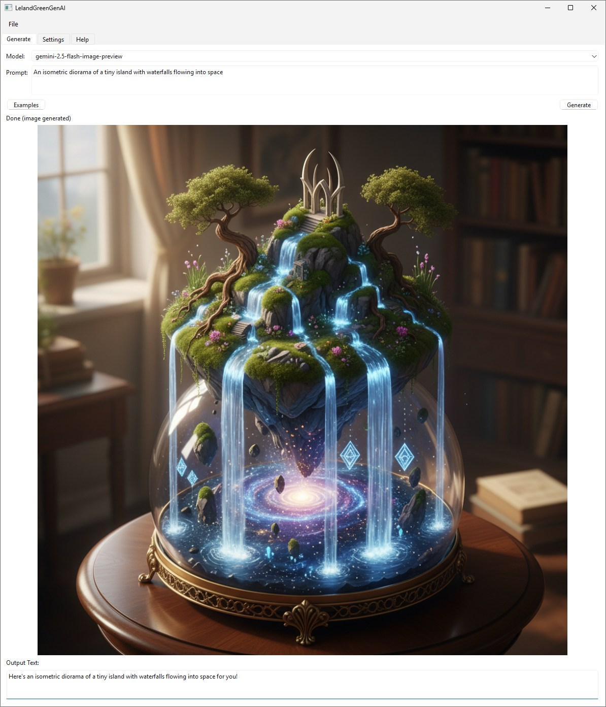

# LelandGreenGenAI — User Manual

###### See [LelandGreen.com](https://www.lelandgreen.com) for links to other code and free stuff.
#### Created with _JetBrains **PyCharm**_ and _Junie_ with just a few prompts on the first day Google Nano Banana was available to the public.
###### So I should share it, right? 😉 Shared the first day, too. Enjoy!  

Welcome! LelandGreenGenAI is a simple desktop app and CLI to generate images and text using Google’s Gemini API and OpenAI’s image models (DALL·E‑3, DALL·E‑2). It stores your API keys securely in your per‑user configuration directory and works on Windows, macOS, and Linux.

Note: Google Nano Banana is Gemini



This guide covers:
- What you need
- How to get your Google AI/Gemini API key and enable billing (and optional OpenAI API key)
- Installing and running the app (GUI and CLI)
- Storing and managing your API key
- Example prompts and usage
- Troubleshooting and FAQs


## 1) Requirements
- A Google account.
- A Gemini API key (see below).
  - At the time of writing, Gemini is in Preview mode and is free.
- Optional: An OpenAI account and API key (for DALL·E models).
- Python 3.9+ recommended.
- Internet access.
- Dependencies (installed via requirements.txt): google-genai, PySide6 (for GUI), protobuf, pillow, openai.


## 2) Get your Gemini API key and enable billing
The Gemini API for developers is provided by Google AI for Developers. Follow these steps:

1. Review the docs and terms:
   - Gemini API overview: https://ai.google.dev/
   - Quickstarts and guides: https://ai.google.dev/docs
   - Pricing and quotas: https://ai.google.dev/pricing
   - Safety policies: https://ai.google.dev/gemini-api/docs/safety

2. Create or sign in to your Google account.

3. Obtain an API key:
   - Go to Google AI Studio API Keys: https://aistudio.google.com/apikey
   - If prompted, follow on‑screen steps to create a new API key.
   - Copy the API key (keep it secret).

4. Set up billing if required:
   - Some regions/models require billing to be enabled before the API works.
   - If you see prompts about billing in AI Studio, follow the instructions to add a valid payment method.
   - See pricing and quotas: https://ai.google.dev/pricing

5. Keep your API key safe. Do not commit it to source control.

### OpenAI API key (optional)
If you want to use OpenAI’s image models (DALL·E‑3, DALL·E‑2):
- Create/sign in to your OpenAI account: https://platform.openai.com/
- Create an API key: https://platform.openai.com/api-keys
- Review pricing and quotas: https://platform.openai.com/docs/guides/rate-limits and https://openai.com/pricing
- Keep your API key secret and never commit it to source control.


## 3) Installation
1. Create and activate a virtual environment (recommended).
2. Install dependencies from requirements.txt:

   Windows PowerShell:
   - python -m venv .venv
   - .\.venv\Scripts\Activate.ps1
   - pip install -r requirements.txt

   macOS/Linux (bash/zsh):
   - python3 -m venv .venv
   - source .venv/bin/activate
   - pip install -r requirements.txt

If you plan to use the GUI, ensure PySide6 is installed (it’s in requirements.txt).


## 4) Running the app
- GUI (default):
  - python main.py

- CLI (any argument triggers CLI mode, including -h):
  - Show help: python main.py -h
  - Print API key setup help: python main.py -H  (or --help-api-key)
  - Test your key (Google by default): python main.py -t
  - Test OpenAI key: python main.py --provider openai -t
  - Generate (Google): python main.py -p "A whimsical city of candy at sunset" -o generated.png
  - Generate (OpenAI DALL·E‑3): python main.py --provider openai -m dall-e-3 -p "Isometric cutaway of a treehouse library with glowing lanterns" -o treehouse.png


## 5) Managing your API key
You can provide keys per provider via command line, a file, environment variable, or the GUI Settings tab. Precedence (per provider): CLI key > CLI key file > stored config > environment variable (GOOGLE_API_KEY or OPENAI_API_KEY).

- One‑time save (persist to user config, per provider):
  - Google from file: python main.py -s -K "C:\\path\\to\\google_key.txt"
  - Google from value: python main.py -s -k "YOUR_GOOGLE_KEY"
  - OpenAI from file: python main.py --provider openai -s -K "C:\\path\\to\\openai_key.txt"
  - OpenAI from value: python main.py --provider openai -s -k "YOUR_OPENAI_KEY"

- Environment variables (session only):
  - Google:
    - Windows PowerShell: $env:GOOGLE_API_KEY = "YOUR_GOOGLE_KEY"
    - macOS/Linux: export GOOGLE_API_KEY="YOUR_GOOGLE_KEY"
  - OpenAI:
    - Windows PowerShell: $env:OPENAI_API_KEY = "YOUR_OPENAI_KEY"
    - macOS/Linux: export OPENAI_API_KEY="YOUR_OPENAI_KEY"

- GUI:
  - Open Settings tab.
  - Paste your API key and click “Save & Test”.
  - Or click “Load from file…” to select a text file containing the key on the first non‑empty line.
  - Use “Get API key” to open the AI Studio key page.

Where your key is stored (per user):
- Windows: %APPDATA%\LelandGreenGenAI\config.json
- macOS: ~/Library/Application Support/LelandGreenGenAI/config.json
- Linux: $XDG_CONFIG_HOME/LelandGreenGenAI/config.json or ~/.config/LelandGreenGenAI/config.json


## 6) CLI reference
- -k, --api-key TEXT        API key string (takes precedence)
- -K, --api-key-file PATH   Path to a file containing the API key
- -s, --set-key             Persist the provided key to user config
- -t, --test                Test that the resolved API key works
- -p, --prompt TEXT         Prompt to generate from (CLI mode)
- -m, --model TEXT          Model to use (default depends on provider; Google: gemini-2.5-flash-image-preview, OpenAI: dall-e-3)
- -o, --out PATH            Output path for the first generated image (if any)
-     --provider {google|openai}  Provider to use (default: google)
- -H, --help-api-key        Print API key setup help and exit

Run without arguments to open the GUI.


## 7) Using the GUI
- Generate tab:
  - Choose a model:
    - Google: gemini-2.5-flash-image-preview (default) and other listed Gemini models.
    - OpenAI: dall-e-3, dall-e-2.
  - Enter a prompt. Click Examples for curated prompts (opens the Examples & Templates dialog).
  - Templates: In the Examples & Templates dialog, switch to the Templates tab to fill in optional placeholders that are substituted into the prompt. You can check "Append to current prompt instead of replacing" to append the generated text to your existing prompt.
  - Click Generate. If an image is returned, it will be auto-saved to your per-user Generated folder (see Section 8). You can also use “Save Image As…” from the File menu to choose a location.

- Settings tab:
  - Provider: choose google or openai. The model list updates accordingly.
    - API Key field applies to the selected provider; switching providers shows the saved key for that provider (if any).
  - View the config file location.
  - “Load from file…” to read a key from a text file.
  - “Save & Test” to store the key and validate with a quick call.
  - Optional: enable “Copy filename to clipboard” to automatically copy the saved image filename.
  - “Get API key” opens the API key page for the selected provider (Google AI Studio or OpenAI).

- Help tab:
  - Displays this README as formatted documentation.


## 8) Image saving, history, and metadata
- Auto-save location: images are automatically saved to your per-user folder:
  - Windows: %APPDATA%\LelandGreenGenAI\generated
  - macOS: ~/Library/Application Support/LelandGreenGenAI/generated
  - Linux: $XDG_CONFIG_HOME/LelandGreenGenAI/generated or ~/.config/LelandGreenGenAI/generated
- Filenames are derived from the first line of your prompt and sanitized; long names are trimmed.
- Alongside each image, a .json “sidecar” file is written with metadata:
  - prompt, model, provider, created_at, app_version, optional output_text, basic settings flags, and optional template context (when using Templates).
- The GUI keeps an in-session History list of recently saved image paths for quick access.
- You can optionally copy the saved image filename to the clipboard automatically (Settings).

## 9) Example prompts
- A whimsical city made of candy canes and gumdrops at sunset, ultra‑detailed, 8k
- A photorealistic glass terrarium containing a micro jungle with tiny glowing fauna
- Retro‑futuristic poster of a rocket‑powered bicycle racing across neon clouds
- An isometric diorama of a tiny island with waterfalls flowing into space

More inspiration:
- Gemini image generation docs: https://ai.google.dev/gemini-api/docs/image-generation
- Cookbook quickstarts (Gemini): https://colab.research.google.com/github/google-gemini/cookbook/blob/main/quickstarts/Image_out.ipynb


## 10) Troubleshooting / FAQ
- I get an authentication error (Google):
  - Ensure your API key is correct and active in https://aistudio.google.com/apikey
  - If required, enable billing and check quotas: https://ai.google.dev/pricing
  - Try: python main.py -t to validate the key.

- I get an authentication error (OpenAI):
  - Ensure your API key is created at https://platform.openai.com/api-keys
  - Check rate limits/quotas and billing: https://platform.openai.com/docs/guides/rate-limits and https://openai.com/pricing
  - Try: python main.py --provider openai -t

- The GUI doesn’t start:
  - Ensure PySide6 is installed (pip install PySide6).
  - Run from a virtual environment with the dependencies installed.

- No image saved from CLI (Google):
  - Some prompts return text only. Try a more image‑forward prompt.

- No image generated with OpenAI provider:
  - Use a supported model (e.g., -m dall-e-3).
  - Check your OpenAI quota and content policy restrictions; some prompts may be blocked.
  - Try a more descriptive prompt. If an error dialog appears, read the message for quota/policy details.

- Where is my config stored?
  - See the paths listed above in Section 5.

- Module not found: google.genai
  - Install the correct package name: pip install google-genai (requirements.txt already includes it).
- Module not found: openai
  - Install: pip install openai (requirements.txt already includes it).

## 11) License and acknowledgements
- Uses Google’s Gemini API (google-genai) and OpenAI’s Images API (openai) when the OpenAI provider is selected.
- Prompts and examples inspired by the official docs.

## 12) Credits
- Templates and inspiration reference: https://ai.google.dev/gemini-api/docs/image-generation
- Developed with JetBrains PyCharm and Junie.

## 13) Changelog
- 0.6.0 (2025-08-29):
  - Added OpenAI provider with DALL·E‑3 and DALL·E‑2 image generation.
  - Per‑provider API keys, OPENAI_API_KEY support, and --provider CLI flag.
  - Updated GUI Settings for provider switching; README updated.
- 0.3.0 (2025-08-29):
  - Added comprehensive README with GUI/CLI, auto-save, and sidecar docs.
  - requirements.txt now uses the correct package name google-genai.

## 14) Future Plans

- Additional Image Generation Providers:
    - Stability AI integration
    - RunwayML integration
    - Adobe Firefly integration
- Open Source Image Generators:
    - Stable Diffusion integration
    - Local model support for offline generation
    - Custom model loading capability
- Enhanced Features:
    - Provider comparison view
    - Batch processing
    - Image editing and manipulation
    - Prompt templating and history
    - Export/import of settings and history

## Appendix: Minimal example (CLI)
```
# Google (Gemini)
python main.py --provider google -s -k "YOUR_GOOGLE_API_KEY"
python main.py -p "A whimsical city of candy at sunset" -o candy.png

# OpenAI (DALL·E‑3)
python main.py --provider openai -s -k "YOUR_OPENAI_API_KEY"
python main.py --provider openai -m dall-e-3 -p "Isometric cutaway of a treehouse library with glowing lanterns" -o treehouse.png
```
