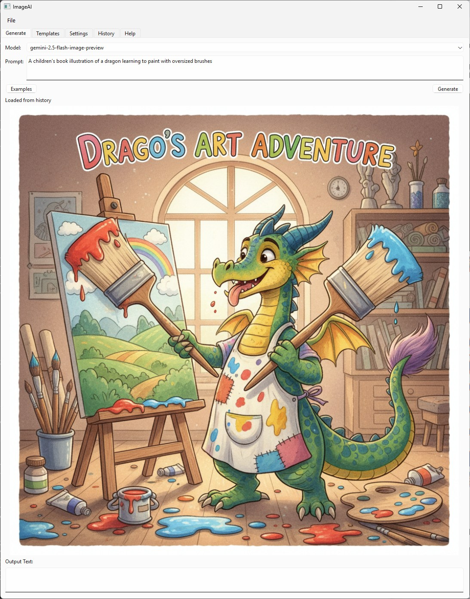

# ImageAI — Advanced AI Image Generation

**Version 0.10.0**

> **📢 Note:** The new Video Project feature (🎬 Video tab) is currently in beta development. The interface is available for preview, but video generation functionality is still being implemented.

###### See [LelandGreen.com](https://www.lelandgreen.com) for links to other code and free stuff.
#### Created with _JetBrains **PyCharm**_ and AI assistance from Junie, Claude Codex. With Google auth guidance from Gemini CLI.
###### Enterprise-ready with multiple authentication methods and provider support  

## Overview

**ImageAI** is a powerful desktop application and CLI tool for AI image generation supporting multiple providers including Google's Gemini API, OpenAI's DALL·E models, Stability AI's Stable Diffusion, and local Stable Diffusion models. It features enterprise-grade authentication options, secure credential management, and works seamlessly across Windows, macOS, and Linux.

## Table of Contents
- [Requirements](#1-requirements)
- [Authentication Setup](#2-authentication-setup)
- [Installation](#3-installation)
- [Running the Application](#4-running-the-application)
- [Authentication Management](#5-authentication-management)
- [CLI Reference](#6-cli-reference)
- [GUI Features](#7-gui-features)
- [Image Management](#8-image-management)
- [Examples & Templates](#9-examples--templates)
- [Advanced Features](#10-advanced-features)
- [Frequently Asked Questions](#11-frequently-asked-questions)
- [API Reference](#12-api-reference)
- [Development](#13-development)
- [Changelog](#14-changelog)

## Key Features

### 🎨 Multi-Provider Support
- **Google Gemini** - Access to latest Gemini models for image generation
- **OpenAI DALL·E** - Support for DALL·E-3 and DALL·E-2 models
- **Stability AI** - Stable Diffusion XL, SD 2.1, and more via API
- **Local Stable Diffusion** - Run models locally without API keys (GPU recommended)
- Easy provider switching in both GUI and CLI
- Support for custom Hugging Face models
- Model browser and downloader for Local SD models
- Popular model recommendations with descriptions

### 🔐 Flexible Authentication
- **API Key Authentication** - Simple setup for individual users
- **Google Cloud Authentication** - Enterprise-ready with Application Default Credentials
- **Hugging Face Authentication** - Built-in token management for model downloads
- Secure credential storage in platform-specific directories
- Environment variable support for CI/CD integration
- Per-provider API key management

### 💻 Triple Interface
- **Modern GUI** - User-friendly desktop interface built with Qt/PySide6
- **Video Project (Beta)** - New 🎬 Video tab for creating AI-powered videos from text/lyrics
- **Powerful CLI** - Full-featured command-line interface for automation
- Cross-platform support (Windows, macOS, Linux)
- Responsive layout with resizable panels

### 🎯 Advanced Generation Controls
- **Visual Aspect Ratio Selector** - Interactive preview rectangles for aspect ratios
- **Smart Resolution Presets** - Provider-optimized resolution settings
- **Quality & Style Options** - Standard/HD quality, style presets for different looks
- **Batch Generation** - Generate multiple variations at once
- **Cost Estimation** - Real-time cost calculation for all providers
- **Advanced Settings Panel** - Fine-tune generation parameters:
  - Inference steps (1-50)
  - Guidance scale (CFG 0-20)
  - Scheduler selection
  - Seed control for reproducibility
  - Negative prompts
  - Prompt rewriting/enhancement

### 📊 Enhanced History & Tracking
- **Detailed History Table** - View all generations with:
  - Date and time stamps
  - Provider and model used
  - Resolution information
  - Cost tracking
  - Original prompts
- **Session Persistence** - All UI settings saved between sessions
- **Metadata Sidecars** - JSON files with complete generation details
- **Disk History Scanning** - Automatically finds previous generations
- **Quick History Access** - Click to reload prompts and settings

### 🖼️ Smart Features
- Auto-save generated images with metadata sidecars
- Template system with placeholder substitution
- Customizable output paths and filenames
- Auto-copy filename to clipboard option
- Smart filename generation from prompts
- Image format detection and optimization
- Preview scaling with aspect ratio preservation

### 🔧 Developer Features
- Modular architecture with provider abstraction
- Worker threads for non-blocking generation
- Comprehensive error handling and recovery
- Progress tracking and status updates
- Event-driven architecture with Qt signals
- Extensible provider system for new services



## 1. Requirements

- Python 3.9+ (3.9 to 3.13 supported)
- Internet connection
- Google account (for Gemini) or OpenAI account (for DALL·E)
- Dependencies (auto-installed via requirements.txt):
  - `google-genai` - Google Gemini API client
  - `google-cloud-aiplatform` - Google Cloud authentication support
  - `openai` - OpenAI API client
  - `PySide6` - GUI framework (optional for CLI-only usage)
  - `pillow` - Image processing
  - `protobuf` - Protocol buffer support

## 2. Authentication Setup

### Google Gemini Authentication

You have two options for authenticating with Google's Gemini API:

#### Option A: API Key (Recommended for Individual Users)

1. **Get your API key**:
   - Visit [Google AI Studio](https://aistudio.google.com/apikey)
   - Create a new API key or use an existing one
   - Copy the key (keep it secure!)

2. **Review documentation**:
   - [Gemini API Overview](https://ai.google.dev/)
   - [Pricing and Quotas](https://ai.google.dev/pricing)
   - [Safety Policies](https://ai.google.dev/gemini-api/docs/safety)

3. **Enable billing if required**:
   - Some regions/models require billing
   - Visit [Google AI Pricing](https://ai.google.dev/pricing)

#### Option B: Google Cloud Account (Enterprise/Advanced Users)

1. **Install Google Cloud CLI**:
   - Download from [Google Cloud SDK](https://cloud.google.com/sdk/docs/install)
   - Windows: Use the interactive installer
   - macOS: `brew install google-cloud-sdk`
   - Linux: Follow distribution-specific instructions

2. **Set up Google Cloud project**:
   - Create/select project at [Cloud Console](https://console.cloud.google.com/projectcreate)
   - Note your Project ID

3. **Authenticate**:
   ```bash
   # Login to Google account
   gcloud auth application-default login
   
   # Set your project
   gcloud config set project YOUR_PROJECT_ID
   
   # Verify authentication
   gcloud auth list
   ```

4. **Enable required APIs**:
   ```bash
   gcloud services enable aiplatform.googleapis.com
   gcloud services enable cloudresourcemanager.googleapis.com
   ```
   Or enable via [Cloud Console](https://console.cloud.google.com/apis/library)

5. **Enable billing**:
   - Visit [Cloud Billing](https://console.cloud.google.com/billing)
   - New accounts may have free credits

### OpenAI Authentication

1. **Get your API key**:
   - Sign in at [OpenAI Platform](https://platform.openai.com/)
   - Create API key at [API Keys page](https://platform.openai.com/api-keys)

2. **Review documentation**:
   - [Rate Limits](https://platform.openai.com/docs/guides/rate-limits)
   - [Pricing](https://openai.com/pricing)

## 3. Installation

### Quick Setup

```bash
# Clone the repository
git clone https://github.com/yourusername/ImageAI.git
cd ImageAI

# Create virtual environment (recommended)
python -m venv .venv

# Activate virtual environment
# Windows PowerShell:
.\.venv\Scripts\Activate.ps1
# Windows Command Prompt:
.venv\Scripts\activate.bat
# macOS/Linux:
source .venv/bin/activate

# Install core dependencies
pip install -r requirements.txt

# Optional: Install Local Stable Diffusion support
# For CPU-only:
pip install -r requirements-local-sd.txt

# For GPU support (CUDA):
pip install torch torchvision --index-url https://download.pytorch.org/whl/cu121
pip install -r requirements-local-sd.txt
```

### Platform-Specific Notes

- **Windows**: Ensure Python is added to PATH during installation
- **macOS**: You may need to install Xcode Command Line Tools
- **Linux**: Install python3-venv if not present: `sudo apt install python3-venv`

## 4. Running the Application

### GUI Mode (Default)

```bash
# Launch the graphical interface
python main.py
```

### CLI Mode

```bash
# Show help
python main.py -h

# Quick examples
python main.py -p "A majestic mountain landscape at sunset" -o mountain.png
python main.py --provider openai -m dall-e-3 -p "Futuristic cityscape" -o city.png
```

### Authentication Examples

#### Using API Keys

```bash
# Google Gemini with API key
python main.py -s -k "YOUR_GOOGLE_API_KEY"  # Save key
python main.py -p "Beautiful ocean sunset" -o ocean.png  # Generate

# OpenAI with API key
python main.py --provider openai -s -k "YOUR_OPENAI_API_KEY"  # Save key
python main.py --provider openai -m dall-e-3 -p "Abstract art" -o art.png  # Generate

# Using environment variables
export GOOGLE_API_KEY="YOUR_KEY"  # Linux/macOS
$env:GOOGLE_API_KEY = "YOUR_KEY"  # Windows PowerShell
python main.py -p "Mountain landscape"  # Uses env variable
```

#### Using Google Cloud Authentication

```bash
# First-time setup
gcloud auth application-default login
gcloud config set project YOUR_PROJECT_ID

# Generate images
python main.py --auth-mode gcloud -p "Tropical paradise" -o paradise.png

# Test authentication
python main.py --auth-mode gcloud -t
```

#### Loading Keys from Files

```bash
# Save key from file
python main.py -s -K /path/to/key.txt

# Use key file directly (one-time)
python main.py -K /path/to/key.txt -p "Desert oasis" -o oasis.png
```

## 5. Authentication Management

### Key Storage Locations

Configuration and keys are stored in platform-specific directories:

- **Windows**: `%APPDATA%\ImageAI\config.json`
- **macOS**: `~/Library/Application Support/ImageAI/config.json`
- **Linux**: `~/.config/ImageAI/config.json`

### Authentication Precedence

For each provider, the authentication order is:
1. Command-line key (`-k` or `-K` flags)
2. Stored configuration
3. Environment variables (`GOOGLE_API_KEY`, `OPENAI_API_KEY`)
4. Google Cloud ADC (for Google provider with `--auth-mode gcloud`)

### Security Best Practices

- Never commit API keys to version control
- Use environment variables for CI/CD
- Rotate keys regularly
- Use Google Cloud authentication for enterprise deployments
- Store keys in secure password managers

## 6. CLI Reference

### Core Arguments

```
-h, --help              Show help message
-p, --prompt TEXT       Prompt for image generation
-o, --out PATH          Output path for generated image
-m, --model TEXT        Model to use (provider-specific)
-t, --test              Test authentication
```

### Authentication Arguments

```
-k, --api-key TEXT      API key string
-K, --api-key-file PATH Path to file containing API key
-s, --set-key           Save the provided key
--auth-mode {api-key|gcloud}  Google auth mode (default: api-key)
```

### Provider Arguments

```
--provider {google|openai|stability|local_sd}  Provider to use (default: google)
```

### Model Defaults

- **Google**: `gemini-2.5-flash-image-preview`
- **OpenAI**: `dall-e-3`
- **Stability AI**: `stable-diffusion-xl-1024-v1-0`
- **Local SD**: `stabilityai/stable-diffusion-2-1`

### Complete Examples

```bash
# Test authentication
python main.py -t
python main.py --provider openai -t
python main.py --provider stability -t
python main.py --provider local_sd -t  # Check if ML deps installed
python main.py --auth-mode gcloud -t

# Generate with different providers
python main.py -p "Sunset over mountains" -o sunset.png
python main.py --provider openai -m dall-e-2 -p "Abstract art" -o abstract.png
python main.py --provider stability -p "Fantasy landscape" -o fantasy.png
python main.py --provider local_sd -p "Cyberpunk city" -o cyber.png
python main.py --auth-mode gcloud -p "Space station" -o space.png

# Save and use API keys
python main.py -s -k "YOUR_KEY"  # Save to config
python main.py --provider stability -s -k "YOUR_STABILITY_KEY"
python main.py -K ~/keys/api.txt -p "Ocean waves"  # Use from file
```

## 7. GUI Features

### Main Interface

#### Generate Tab
- **Model Selection**: Dropdown with provider-specific models
- **Prompt Input**: Multi-line text area for detailed prompts
- **Generate Button**: Start image generation with progress tracking
- **Image Display**: High-quality preview with automatic scaling
- **Generation Controls**:
  - Aspect ratio selector with visual previews
  - Resolution selector with provider-optimized presets
  - Quality settings (Standard/HD)
  - Batch size selector (1-4 images)
  - Cost estimator showing real-time pricing
- **Advanced Settings** (collapsible panel):
  - Inference steps slider (1-50)
  - Guidance scale (CFG) control
  - Scheduler selection
  - Seed input for reproducibility
  - Negative prompt field
  - Prompt rewriting toggle
- **Output Text**: Live generation status and file paths
- **Examples Button**: Access curated prompts library

#### Video Tab (Beta)
- **Project Management**: Create, open, and save video projects
- **Text Input**: Support for lyrics, scripts, or any text content
- **Input Formats**:
  - Timestamped lyrics `[mm:ss] text`
  - Structured text with sections `# Verse`, `# Chorus`
  - Plain text with automatic scene detection
- **Scene Generation**: Automatic storyboard creation with timing
- **AI Enhancement**: LLM-powered prompt generation (OpenAI, Claude, Gemini, Ollama)
- **Audio Support**: Link audio files with volume and fade controls
- **Export Options**: Prepared for local slideshow and Gemini Veo rendering
- **Note**: Currently in beta - full video generation coming soon

#### Settings Tab
- **Provider Selection**: Switch between Google, OpenAI, Stability AI, and Local SD
- **Authentication Mode** (Google only):
  - API Key mode with key input field
  - Google Cloud Account mode with status display
- **Helper Buttons**:
  - Get API Key - Opens provider's key page
  - Load from File - Import key from text file
  - Check Status - Verify authentication
  - Cloud Console - Open Google Cloud Console (Google only)
- **Auto-save Options**: 
  - Auto-save generated images toggle
  - Copy filename to clipboard option
  - Custom output directory selection
- **Local SD Settings** (when selected):
  - Model browser and downloader
  - Hugging Face authentication
  - Cache directory management
  - GPU/CPU device selection

#### Templates Tab
- Predefined prompt templates with placeholders
- Variable substitution system with live preview
- Template categories:
  - Art Style
  - Photography
  - Design
  - Character
  - Scene
  - Product
  - Marketing
- Append or replace current prompt
- Custom template creation and saving

#### History Tab
- **Detailed History Table** with columns:
  - Date and time
  - Provider used
  - Model name
  - Resolution
  - Cost (when applicable)
  - Original prompt
- **Quick Actions**:
  - Click to reload prompt and settings
  - Open image file location
  - View metadata sidecar
- **Search and Filter**:
  - Filter by provider
  - Search by prompt text
  - Sort by date, cost, or model

#### Help Tab
- Embedded README documentation with full content
- **Interactive Search**:
  - Search box with real-time results
  - Navigate between matches with Previous/Next buttons
  - Match counter showing current/total results
  - Keyboard shortcuts (F3 for next, Shift+F3 for previous)
- Navigation controls:
  - Back/Forward buttons for history
  - Home button to return to top
  - Keyboard navigation (Alt+Left/Right, Backspace)
- Quick reference guide
- Keyboard shortcuts reference
- Provider-specific tips
- Troubleshooting guide

### Menu System

#### File Menu
- New Generation (Ctrl+N)
- Save Image As... (Ctrl+S)
- Open Output Directory
- Recent Files
- Exit (Ctrl+Q)

#### Edit Menu
- Copy Prompt (Ctrl+C)
- Paste Prompt (Ctrl+V)
- Clear All (Ctrl+Shift+C)
- Copy Image to Clipboard
- Copy Filename

#### View Menu
- Show/Hide History Panel
- Show/Hide Advanced Settings
- Full Screen Mode (F11)
- Reset Layout
- Zoom In/Out

#### Tools Menu
- Model Browser (Local SD)
- Batch Generator
- Template Editor
- Settings Manager

#### Help Menu
- Documentation (F1)
- Keyboard Shortcuts
- Check for Updates
- About ImageAI

## 8. Image Management

### Auto-Save System

Generated images are automatically saved to:
- **Windows**: `%APPDATA%\ImageAI\generated\`
- **macOS**: `~/Library/Application Support/ImageAI/generated/`
- **Linux**: `~/.config/ImageAI/generated/`

### File Naming

- Filenames derived from prompt (sanitized)
- Timestamp added for uniqueness
- Format: `prompt_words_YYYYMMDD_HHMMSS.png`

### Metadata Sidecars

Each image gets a `.json` sidecar file containing:
```json
{
  "prompt": "User's prompt text",
  "model": "Model used",
  "provider": "Provider name",
  "created_at": "ISO timestamp",
  "app_version": "Version number",
  "output_text": "Any text output",
  "template": "Template data if used"
}
```

### History Tracking

- In-session history of generated images
- Persistent history across sessions
- Quick access to recent generations
- Metadata search and filtering

## 9. Examples & Templates

### Example Prompts

#### Artistic Styles
```
"Oil painting of a serene mountain lake at golden hour, impressionist style"
"Cyberpunk street scene with neon lights and rain reflections, ultra-detailed"
"Watercolor portrait of a wise owl in autumn forest, soft pastels"
```

#### Photorealistic
```
"Professional photograph of a modern minimalist living room, magazine quality"
"Macro shot of dewdrops on a spider web at sunrise, shallow depth of field"
"Aerial view of tropical islands with crystal clear water, drone photography"
```

#### Creative Concepts
```
"Steampunk airship floating above Victorian London, brass and copper details"
"Bioluminescent underwater cave with glowing creatures, fantasy art"
"Isometric cutaway of a cozy treehouse library with magical elements"
```

### Template System

The template system allows you to create consistent, reusable prompts with variable placeholders.

#### Using Templates

1. **Select a Template**: Choose from the dropdown in the Templates tab
2. **Fill Placeholders**: Enter values for each variable field (optional)
3. **Preview**: See the assembled prompt update in real-time
4. **Insert**: Click "Insert into Prompt" to use the template
5. **Append Option**: Check "Append to existing" to add to current prompt

#### Built-in Templates

**Portrait Photography**:
```
"[style] portrait of [subject] with [expression], [lighting] lighting, [background] background"
```

**Landscape Scene**:
```
"[time_of_day] landscape of [location] with [features], [weather] weather, [style] style"
```

**Product Shot**:
```
"Product photography of [item] on [surface], [lighting] lighting, [angle] angle, commercial quality"
```

**Fantasy Art**:
```
"[character] [action] in [setting], [magic_effect], [art_style] fantasy art style"
```

**Architectural**:
```
"[building_type] in [architectural_style] style, [time_of_day], [weather], [perspective] view"
```

#### Template Variables

- Variables are defined with square brackets: `[variable_name]`
- Leaving a field empty removes it from the final prompt
- Multiple instances of the same variable use the same value
- Commas are automatically managed when variables are empty

### Tips for Better Results

**Be Specific**: Instead of "a cat", try "a fluffy orange tabby cat sitting on a windowsill"

**Include Style**: Add artistic style like "oil painting", "photorealistic", "cartoon style"

**Describe Mood**: Include lighting and atmosphere like "golden hour", "dramatic lighting", "cozy"

**Add Details**: More details generally produce better results

**Composition Tips**:
- Use camera angles: "aerial view", "close-up", "wide angle"
- Specify perspective: "first-person view", "isometric", "side profile"
- Include depth: "shallow depth of field", "bokeh background", "infinite focus"

**Quality Modifiers**:
- "highly detailed", "ultra-realistic", "4K", "HD"
- "professional photography", "award-winning"
- "trending on artstation", "masterpiece"

## 10. Advanced Features

### Keyboard Shortcuts

**GUI Mode**:
- **Ctrl+Enter**: Generate image
- **Ctrl+S**: Save current image as...
- **Ctrl+Q**: Quit application
- **Ctrl+N**: Clear prompt
- **Ctrl+A**: Select all text
- **Ctrl+C/V/X**: Copy/Paste/Cut
- **Tab**: Switch between tabs
- **F1**: Show help
- **F3**: Find next in help documentation
- **Shift+F3**: Find previous in help documentation
- **Ctrl+F**: Focus search box in help tab
- **Alt+Left/Backspace**: Navigate back in help
- **Alt+Right**: Navigate forward in help
- **Ctrl+Home**: Go to top of help

### Batch Generation

Generate multiple images with variations:

```bash
# Generate 3 variations of the same prompt
for i in {1..3}; do python main.py -p "Sunset landscape" -o "sunset_$i.png"; done

# Generate from a list of prompts
while read prompt; do
  python main.py -p "$prompt" -o "${prompt// /_}.png"
done < prompts.txt
```

### Using Environment Variables

```bash
# Set default provider
export IMAGEAI_PROVIDER="openai"
export OPENAI_API_KEY="your-key"

# Set default model
export IMAGEAI_MODEL="dall-e-3"

# Set output directory
export IMAGEAI_OUTPUT_DIR="/path/to/images"
```

### Custom Configuration

Edit config file directly:
- **Windows**: `%APPDATA%\ImageAI\config.json`
- **macOS**: `~/Library/Application Support/ImageAI/config.json`
- **Linux**: `~/.config/ImageAI/config.json`

Example config:
```json
{
  "provider": "google",
  "google_api_key": "your-key",
  "openai_api_key": "your-key",
  "stability_api_key": "your-key",
  "auto_save": true,
  "output_format": "png",
  "jpeg_quality": 95,
  "default_model": {
    "google": "gemini-2.5-flash-image-preview",
    "openai": "dall-e-3",
    "stability": "stable-diffusion-xl-1024-v1-0"
  }
}
```

### Local Stable Diffusion Settings

When using Local SD provider, advanced settings are available:

**Inference Steps**: Number of denoising steps (1-50)
- More steps = better quality but slower
- Turbo models: 1-4 steps
- Standard models: 20-50 steps
- Real-time preview of step count impact

**Guidance Scale (CFG)**: How closely to follow prompt (0-20)
- Lower (1-5): More creative/artistic
- Medium (7-8): Balanced
- Higher (10-15): More literal prompt following
- Visual indicator shows optimal range per model

**Resolution**: Output image dimensions
- SD 1.5/2.1: 512x512 optimal
- SDXL: 1024x1024 optimal
- Custom sizes supported but may affect quality
- Aspect ratio preservation with smart presets

**Scheduler**: Sampling algorithm
- DPM++ 2M Karras: Good balance
- Euler A: Fast, good for most cases
- DPM++ SDE Karras: Higher quality, slower
- DDIM: Deterministic, good for reproducibility
- LMS: Classic scheduler
- PNDM: Fast convergence

**Additional Controls**:
- **Seed**: Set specific seed for reproducible results
- **Negative Prompt**: Specify what to avoid in generation
- **VAE Selection**: Choose different VAE models for style
- **Attention Slicing**: Memory optimization for large images
- **CPU Offload**: Move models to CPU when not in use

### Hugging Face Model Management

**Using Custom Models**:
```bash
# Download a specific model
python main.py --provider local_sd -m "runwayml/stable-diffusion-v1-5" -p "Test" -o test.png

# Use downloaded model (cached)
python main.py --provider local_sd -m "runwayml/stable-diffusion-v1-5" -p "Art" -o art.png
```

**Popular Models**:
- `stabilityai/stable-diffusion-2-1`: Balanced quality/speed
- `runwayml/stable-diffusion-v1-5`: Classic, widely compatible
- `stabilityai/stable-diffusion-xl-base-1.0`: High quality, 1024x1024
- `segmind/SSD-1B`: Fast SDXL variant
- `stabilityai/sdxl-turbo`: Ultra-fast 1-4 step generation

**Model Cache Location**:
- Default: `~/.cache/huggingface/hub/`
- Size: Models range from 2GB to 7GB
- First use downloads the model
- Subsequent uses load from cache

### Performance Optimization

**GPU Acceleration** (Local SD only):
```bash
# Install CUDA support
pip install torch torchvision --index-url https://download.pytorch.org/whl/cu121

# Verify GPU is detected
python -c "import torch; print(torch.cuda.is_available())"
```

**Memory Management**:
- Close other applications when using Local SD
- Use smaller models for limited VRAM (< 6GB)
- Enable attention slicing for large images
- Reduce batch size if out of memory

### Troubleshooting Common Issues

#### Startup Performance

The application may take a few seconds to start as it loads AI provider libraries:
- **Google Cloud AI**: ~10-15 seconds on first load (largest library)
- **Google Gemini**: ~2 seconds
- **OpenAI**: ~3 seconds

You'll see "Loading provider: [name]..." in the console during startup. Provider libraries are cached after first load, so switching between providers is faster after the initial import.

#### Authentication Errors

**Google API Key Issues**:
- Verify key at [AI Studio](https://aistudio.google.com/apikey)
- Check billing is enabled
- Ensure API is not restricted by IP

**Google Cloud Auth Issues**:
```bash
# Verify authentication
gcloud auth list
gcloud auth application-default print-access-token

# Enable required APIs
gcloud services enable aiplatform.googleapis.com
gcloud services enable cloudresourcemanager.googleapis.com

# Check project
gcloud config get-value project
```

**OpenAI Issues**:
- Verify key at [OpenAI Platform](https://platform.openai.com/api-keys)
- Check rate limits and quotas
- Ensure billing is active

#### Installation Problems

**Windows PowerShell**:
```powershell
# If scripts are blocked
Set-ExecutionPolicy -ExecutionPolicy RemoteSigned -Scope CurrentUser

# If gcloud not found
$env:PATH += ";C:\Program Files (x86)\Google\Cloud SDK\google-cloud-sdk\bin"
```

**Module Import Errors**:
```bash
# Reinstall specific package
pip install --upgrade google-genai
pip install --upgrade PySide6

# Clear pip cache
pip cache purge
```

#### GUI Issues

**PySide6 not loading**:
```bash
# Install with specific version
pip install PySide6==6.5.3

# Linux: Install system dependencies
sudo apt-get install python3-pyside6
```

**Display scaling issues**:
```bash
# Set Qt scaling
export QT_AUTO_SCREEN_SCALE_FACTOR=1
export QT_SCALE_FACTOR=1.25
```

### Error Messages

| Error | Solution |
|-------|----------|
| "API key not found" | Set key via Settings or use `-s -k YOUR_KEY` |
| "Quota exceeded" | Check billing and quotas in provider console |
| "Invalid prompt" | Avoid restricted content, check provider policies |
| "Module not found" | Run `pip install -r requirements.txt` |
| "gcloud not found" | Install Google Cloud SDK or use API key mode |

## 11. Utility Scripts

### Configuration Migration (`migrate_config.py`)

Migrates old configuration formats to the current structure and optionally secures API keys.

**Usage:**
```bash
# Dry run to see what changes would be made
python migrate_config.py --dry-run

# Perform migration
python migrate_config.py

# Migration without securing keys
python migrate_config.py --no-secure
```

**What it does:**
- Removes legacy `api_key` field from root level
- Fixes incorrect `keys.<provider>` structure
- Moves all API keys to proper `providers.<provider>.api_key` format
- Attempts to secure keys in system keyring when available
- Creates timestamped backups before making changes

### API Key Security (`secure_keys.py`)

**Windows only:** Moves API keys from plaintext config.json to Windows Credential Manager for encryption.

**Usage (run in Windows PowerShell/Command Prompt, not WSL):**
```bash
cd D:\path\to\ImageAI
python secure_keys.py
```

**What it does:**
- Reads API keys from config.json
- Stores them securely in Windows Credential Manager (encrypted by OS)
- Removes plaintext keys from config.json
- Creates backup before modification
- Keys are automatically retrieved by the app when needed

**Benefits:**
- API keys are encrypted by Windows
- Keys survive config.json deletion/corruption
- More secure than plaintext storage
- Works seamlessly with the application

## 12. Frequently Asked Questions

### General Questions

**Q: Which provider should I use?**
A: It depends on your needs:
- **Google Gemini**: Best for general purpose, good quality, reliable
- **OpenAI DALL-E**: Best for creative/artistic images
- **Stability AI**: Best for photorealistic and detailed images
- **Local SD**: Best for privacy, unlimited generation, customization

**Q: Can I use multiple providers?**
A: Yes! You can switch providers anytime in Settings or via CLI `--provider` flag.

**Q: Are my prompts and images private?**
A: 
- API providers (Google, OpenAI, Stability) process prompts on their servers
- Local SD runs entirely on your machine - fully private
- Generated images are saved locally only

**Q: How much does it cost?**
A:
- Google: Free tier available, paid plans for higher usage
- OpenAI: Pay per generation, typically $0.02-0.04 per image
- Stability AI: Credit-based, around $0.01-0.02 per image
- Local SD: Free after initial setup (electricity costs only)

### Setup Issues

**Q: "API key not found" error**
A: 
1. Make sure you've entered the key in Settings
2. Click "Save & Test" to save it
3. Check the key is valid on provider's website

**Q: "Module not found" error**
A: Run `pip install -r requirements.txt` in your terminal

**Q: GUI won't start on Linux**
A: Install system Qt libraries: `sudo apt-get install python3-pyside6`

**Q: Local SD says "No module named 'diffusers'"**
A: Install Local SD dependencies: `pip install -r requirements-local-sd.txt`

### Image Generation Issues

**Q: "Safety filter triggered" or "Blocked" message**
A: Your prompt may contain restricted content. Try:
- Rephrasing your prompt
- Avoiding violence, explicit content, or real people's names
- Using more general terms

**Q: Images are low quality**
A: 
- Add quality modifiers: "high quality", "detailed", "4K"
- Try different models (DALL-E 3, SDXL)
- For Local SD: increase steps and guidance scale

**Q: Generation is very slow**
A: 
- API providers: Network speed dependent, typically 5-20 seconds
- Local SD on CPU: Can take 2-10 minutes
- Local SD on GPU: Usually 10-60 seconds
- Use turbo models for faster generation

**Q: "Out of memory" with Local SD**
A:
- Use smaller models (SD 1.5 instead of SDXL)
- Reduce image resolution
- Close other applications
- Consider upgrading GPU VRAM

### Feature Questions

**Q: Can I edit existing images?**
A: Not yet in current version. Planned features include inpainting and image-to-image.

**Q: Can I generate multiple images at once?**
A: Currently one at a time in GUI. Use CLI with shell scripts for batch generation.

**Q: Can I use my own Stable Diffusion models?**
A: Yes! With Local SD, enter any Hugging Face model ID or use the Model Browser.

**Q: Is there a web version?**
A: Not currently. This is a desktop application. Web interface is planned for future.

**Q: Can I use this commercially?**
A: Check each provider's terms:
- Google, OpenAI: Commercial use allowed with paid plans
- Stability AI: Commercial use allowed
- Local SD: Depends on specific model license

## 13. API Reference

### Provider Specifications

#### Google Gemini Models
- `gemini-2.5-flash-image-preview` (default)
- `gemini-2.0-flash-lite-preview-02-05`
- `gemini-2.0-flash-thinking-exp-01-21`

#### OpenAI Models
- `dall-e-3` (default) - Best quality, 1024x1024
- `dall-e-2` - Good quality, multiple sizes

#### Stability AI Models
- `stable-diffusion-xl-1024-v1-0` (default) - SDXL, best quality
- `stable-diffusion-v1-6` - SD 1.6, balanced
- `stable-diffusion-512-v2-1` - SD 2.1, faster
- `stable-diffusion-xl-beta-v2-2-2` - SDXL beta

#### Local SD Models (Hugging Face)
- `stabilityai/stable-diffusion-2-1` (default)
- `runwayml/stable-diffusion-v1-5` - Popular SD 1.5
- `stabilityai/stable-diffusion-xl-base-1.0` - SDXL base
- `segmind/SSD-1B` - Fast SDXL variant
- Custom models from Hugging Face Hub

### Rate Limits

| Provider | Requests/Min | Daily Limit | Notes |
|----------|-------------|-------------|--------|
| Google (Free) | 60 | 1,500 | Varies by region |
| Google (Paid) | 360 | Unlimited | Billing required |
| OpenAI | Varies | By tier | Check dashboard |
| Stability AI | 150 | By credits | Pay per generation |
| Local SD | Unlimited | Unlimited | Limited by hardware |

### Response Formats

All API providers return images as base64-encoded PNG data or URLs, automatically decoded and saved by the application. Local SD generates images directly as PIL Image objects.

## 14. Development

### Project Structure

```
ImageAI/
├── main.py                   # Main entry point
├── cli/                      # CLI interface
├── gui/                      # GUI interface
├── core/                     # Core functionality
├── providers/                # Provider implementations
│   ├── base.py              # Base provider interface
│   ├── google.py            # Google Gemini provider
│   ├── openai.py            # OpenAI DALL-E provider
│   ├── stability.py         # Stability AI provider
│   └── local_sd.py          # Local Stable Diffusion
├── templates/                # Prompt templates
├── requirements.txt          # Core dependencies
├── requirements-local-sd.txt # Local SD dependencies
├── README.md                 # This file
├── CLAUDE.md                 # Claude AI guidance
├── GEMINI.md                 # Gemini setup guide
├── Plans/                    # Future development plans
│   ├── GoogleCloudAuth.md
│   ├── NewProviders.md
│   └── ProviderIntegration.md
└── .gitignore                # Git ignore rules
```

### Contributing

1. Fork the repository
2. Create a feature branch
3. Make your changes
4. Add tests if applicable
5. Submit a pull request

### Future Plans

- ✅ Stability AI integration (completed)
- ✅ Local Stable Diffusion support (completed)
- Image editing capabilities (inpainting, outpainting) - Partially implemented
- Local model management GUI (Phase 3 in progress)
- Batch processing improvements
- Plugin system for custom providers
- Additional providers (Midjourney API, Adobe Firefly, etc.)
- Web interface option
- Mobile app companion

## 15. Changelog

See [CHANGELOG.md](CHANGELOG.md) for detailed version history and release notes.

### Latest Release: v0.9.4 (2025-09-11)
- **Provider Persistence**: Fixed provider selection not persisting between app restarts
- **Model Display**: Added nicknames and descriptive names for models (e.g., "Nano Banana" for Gemini 2.5 Flash)
- **Google Cloud Auth**: Optimized authentication from 24+ seconds to ~5 seconds
- **UI Controls**: Added Google Cloud authentication button and editable project ID field
- **Bug Fix**: Provider now correctly switches when loading projects and history items
- Configuration migration and security scripts
- API key encryption support via Windows Credential Manager
- Config structure improvements and fixes

For complete changelog, see [CHANGELOG.md](CHANGELOG.md)

## Credits

Created by Leland Green | [LelandGreen.com](https://www.lelandgreen.com)

Built with:
- JetBrains PyCharm
- PySide6/Qt Framework
- Google Gemini API
- OpenAI API

## License

See LICENSE file for details.

## Support

For issues, feature requests, or questions:
- GitHub Issues: [Create an issue](https://github.com/yourusername/ImageAI/issues)
- Email: support@lelandgreen.com

---

**Happy Creating!** 🎨