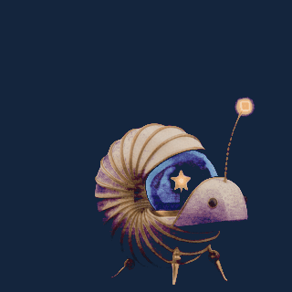

# Lumen, the patient compiler

A paper-and-brass nautilus carries a miniature observatory in its shell. When a
question finally makes sense, its lone star unfolds into a constellation and it
raises a small, slightly improbable hand.

**Creative direction, prompts, CLI implementation and visual QA: Codex (OpenAI).**
Source art and animation poses were generated with Google's image provider through
ImageAI. This sample is included under the repository's license.

This was one of two animations made during a live CLI acceptance test; the other
was a thinking/orbit loop. The CLI created the project, added action cards,
generated sheets, imported a corrected grid, edited frames and timing, processed
HD/pixel profiles, and exported both animations.

The image model returned six poses despite a request for eight. The sheets were
inspected and imported as six columns. A stray mark in the first pose was removed
by deleting that pose through the CLI; the remaining five frames were baked and
processed again. This discovery also led to stricter generated-sheet validation:
uncertain slicing now preserves the generated sheet and reports how to recover.

## Files

- `lumen-aha.gif`: selected 320×320, five-frame loop on a navy background.
- `lumen-source.png`: original generated character.
- `lumen-aha-sheet.png`: original six-pose sheet, preserved for reproduction.
- Matching `.json` files: prompts, provider/model, provenance and export settings.
- `rebuild.py`: reproduces the project and exports from these images through the
  public CLI, without provider calls. It writes to a new temporary project library
  unless `--root` is supplied, and prints the project and output paths as JSON.

Use the [offline workbench](../../Docs/Sprite-CLI-Workbench.html) to build further
requests, or read the [Sprite CLI guide](../../Docs/Sprite-CLI-Guide.md).
